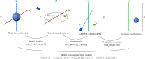
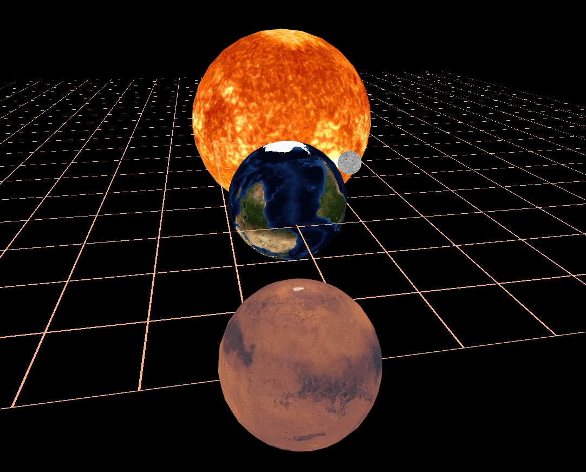

<figure></img></figure>

For several reasons, the GPU pipeline wasn't perfectly suited for ray-tracing as its implementation can only be iterative using this technology (please refer to exercise 2 on Lighting). On the contrary, the rasterization rendering method fits perfectly well the GPU pipeline. In this assignment, you will learn more about the GPU pipeline, and you will implement geometric transforms in the GPU.

A program using the graphics pipeline, like our renderer, is divided into strongly separated and different parts:
some run on the CPU - that is the usual programming we have done elsewhere,
and *"shaders"* - code running on the GPU.
The GPU is often a completely separate device, with its own memory and hardware instructions.
Therefore you will be writing code in these 2 different environments, remembering this will make the exercises easier to understand.

* CPU execution - `.js` files using the [JavaScript](https://developer.mozilla.org/en-US/docs/Web/JavaScript) language, run in the browser.
  * You can print messages to the browser's console using [`console.log('message', value)`](https://developer.mozilla.org/en-US/docs/Web/API/Console/log)
  * You can use the *Debugger* ([Firefox](https://developer.mozilla.org/en-US/docs/Tools/Debugger), [Chrome](https://developers.google.com/web/tools/chrome-devtools/javascript)) to set breakpoints (place where the program pauses) and inspect the variables' values.
  * Operations on vectors and matrices are done with the [gl-matrix](http://glmatrix.net/) library (more below);
  they need an output argument and look like this 
  ```js
  const a_p_b = vec3.add([0, 0, 0], a, b)
  ```
  * Types are not checked ahead of time, errors happen at runtime. Mistakes in mathematical operations often cause the creation of `NaN` values - if you see them, most probably one of the gl-matrix functions did not receive all needed arguments.

* GPU execution - `.glsl` files, using the [GLSL](http://www.shaderific.com/glsl/) language.
  * Operations on vectors and matrices are done using [built-in operators and functions](https://en.wikibooks.org/wiki/GLSL_Programming/Vector_and_Matrix_Operations); look like this
  ```c
  vec3 a_p_b = a + b;
  ```
  * There is no debugger nor variable printing; the output of the shader is the color of a pixel or position of a vertex.
  * The code is compiled before execution, variables are typed and types are checked.


## GPU Pipeline

Rasterization is performed on a GPU (graphics card). GPUs are specialized in massively parallel processing of mesh geometry and image pixels. They operate according to a specific pipeline, 

[Introduction to the Graphics Pipeline](https://www.gamedev.net/tutorials/programming/graphics/introduction-to-the-graphics-pipeline-r3344/)

**GPU pipeline inputs**

- *Vertex attributes*: position, normal, texture coordinates...
- *Faces*: triangles of the mesh, stored as triples of indices
- *Uniforms*: data globally available to the GPU programs, it includes textures

**GPU processing steps**

- *Vertex shader*: program executed for each vertex of the mesh, calculates its position in the image, and intermediate variables used by the fragment shader.
- *Fragment shader*: program executed for each output pixel of the mesh, calculates the pixel's output color.


### regl.js pipeline specification

Let us look at the pipeline declaration in regl.js.
First the pipeline is constructed with the data which does not change during runtime.
This construction step is expensive and should be done only once.
We mark values which change in time using `regl.prop('prop_name')` - we will be able to supply them later when executing the pipeline.

At each frame, we execute the pipeline and provide the dynamic values `draw({prop_name: ...})`.

```js
const regl = createREGL();

// The pipeline is constructed only once!
const draw_triangle = regl({

	// Vertex attributes - properties of each vertes such as position, normal, texture coordinates...
	attributes: {
		// 3 vertices with 2 coordinates each
		position: [
			[0, 0.2], // [x, y] - vertex 0
			[-0.2, -0.2], // [x, y] - vertex 1
			[0.2, -0.2], // [x, y] - vertex 2
		],
	},

	// Triangles (faces), as triplets of vertex indices
	elements: [
		[0, 1, 2], // one triangle here
	],
	
	// Uniforms: global data available to the shader
	uniforms: {
		color: regl.prop('color'),
	},	

	/* 
	Fragment shader program
	Calculates the color of each pixel covered by the mesh.
	The "varying" values are interpolated between the values 
	given by the vertex shader on the vertices of the current triangle.
	*/
	vert: `
	// Vertex attributes, specified in the "attributes" entry of the pipeline
	attribute vec2 position;
			
	void main() {
		// [x, y, 0, 1]
		gl_Position = vec4(position, 0, 1);
	}`,
	
	/* 
	Vertex shader program
	Given vertex attributes, it calculates the position of the vertex on screen
	and intermediate data ("varying") passed on to the fragment shader
	*/
	frag: `
	precision mediump float;
	
	uniform vec3 color;

	void main() {
		// [R, G, B, 1]
		gl_FragColor = vec4(color, 1.); // output: RGBA in 0..1 range
	}`,
});

// Function run to draw each frame
regl.frame((frame) => {
	// Reset the canvas to black
	regl.clear({color: [0, 0, 0, 1]});
		
	// Execute the declared pipeline
	draw_triangle({
		color: [1, 0, 0], // provide the value for regl.prop('color') in uniforms.
	})
});
```

### Shaders

*Shaders* are programs which run on the GPU.
They have their own language, GLSL, which is quite similar to C, with the added [vector and matrix types](http://www.shaderific.com/glsl-types).  
[GLSL reference](http://www.shaderific.com/glsl/)  
[WebGL reference card](https://www.khronos.org/files/webgl/webgl-reference-card-1_0.pdf) page 3-4

The pipeline contains two shader programs:

- *Vertex shader*: executed for each vertex of the mesh, calculates its position in the image, and intermediate variables used by the fragment shader.
- *Fragment shader*: program executed for each output pixel of the mesh, calculates the pixel's output color.

#### Vertex shader
The vertex shader receives as input the vertex attributes specified in the `attributes:` section.
They have to be declared with the `attribute` keyword.

It can pass per-vertex data to the fragment shader, such variables are specified by the `varying` keyword.
The `varying` values are interpolated between the triangle's three vertices weighted by barycentric coordinates.

The vertex shader writes the vertex *image* coordinates to `gl_Position` which is a `vec4` ([homogenous coordinates](https://en.wikipedia.org/wiki/Homogeneous_coordinates)).

```glsl
// Vertex attributes, specified in the "attributes" entry of the pipeline
attribute vec3 position;

// Intermediate value passed on to fragment shader
varying vec2 tex_coord;

void main() {
	// intermediate value passed on to fragment shader
	tex_coord = position.xy;
	// output position [x, y, z, 1]
	gl_Position = vec4(position, 1);	
}
```

#### Fragment shader
It can receive data from the vertex shader, such variables are specified by the `varying` keyword in both shaders.
The `varying` values are interpolated between the triangle's three vertices weighted by barycentric coordinates.

The fragment shader writes the pixel color to `gl_FragColor` as `vec4(Red, Green, Blue, Opacity)`.

Both vertex and fragment shader have access to the global `uniform` values.

```c
// numerical precision of calculation, no consensus which one to use
precision mediump float; 

// Intermediate value from vertex shader have to be declared in both shaders
varying vec2 tex_coord;

// Access global values from the uniforms: section
uniform vec3 color;

void main() {
	// [R, G, B, 1] in 0..1 range
	gl_FragColor = vec4(color, 1.);
}
```


## Matrix operations, gl-matrix
For matrix and vector operations, we will be using [gl-matrix](http://glmatrix.net/). The code of the library is quite straight-forward, see for example the [gl-matrix file mat4.js](https://github.com/toji/gl-matrix/blob/master/src/mat4.js).
We primarily use the 4x4 matrices to express transformation in 3D space - [mat4 documentation](http://glmatrix.net/docs/module-mat4.html).

### Specificities

**Functions instead of operators:** JavaScript does not have [operator overloading](https://en.wikipedia.org/wiki/Operator_overloading), so we can not express matrix multiplication with `*`.

**Printing:** Matrices and vectors are both stored as flat arrays, so a 4x4 matrix is a 16-element array. This array is what you will see if you `console.log(matrix)`. Use `mat4_to_string(m, decimals)` to format the string in a readable form.

**Output argument:** gl-matrix has been designed for fast performance and so it tries to reuse the matrix objects instead of creating new ones (objects have to be then cleared out by the garbage collector).
Therefore in nearly all its functions, the first argument is the output object to which the result is written.
```js
const M_rotation = mat4.create(); // allocate matrix
// set matrix to 45 deg rotation around Z axis
mat4.fromZRotation(M_rotation, 45 * Math.PI / 180);

const C = mat4.create();
// multiply: C = A * B
mat4.multiply(C, A, B);
```
You do not have to reuse the matrices - in our application the performance loss is insignificant.
```js
// allocate a new matrix for the result
const M_rotation = mat4.fromZRotation(mat4.create(), 45 * Math.PI / 180); 
// and
const C = mat4.multiply(mat4.create(), A, B);
```

You *can* do operations *in-place*:
```js
mat4.multiply(A, A, B); // A = A*B
```

### Extra utilities

Since gl-matrix is very basic, we are adding some convenience utilities in `src/icg_math.js`.

* `matrix.get(row, col)` - get element  (row and col and 0-indexed)
* `matrix.set(row, col, value)` - set element (row and col and 0-indexed)
* `mat4_matmul_many` - Multiply any number of matrices:
	
	```js
	//out = m1 * m2 * m3 * ...
	mat4_matmul_many(out, m1, m2, m3, ...)
	```
* `vec_to_string(vector, decimals)` - display a vector with fixed decimal places

* `matrix.toString()` - reprent a matrix as a human-readable string

<div class="box practice">

#### Practice: gl-matrix in the console

* Open `index_2d_transform.html` in your browser and open the Console
* Create a translation matrix
```js
let M_translation = mat4.fromTranslation(mat4.create(), [0, 10, 0]);
M_translation.toString()
```
* Create a rotation matrix
```js
let M_rotation = mat4.fromZRotation(mat4.create(), 45 * Math.PI / 180);
M_rotation.toString()
```
* Combine the transformations by multiplication
```js
let M_RT = mat4_matmul_many(mat4.create(), M_translation, M_rotation);
M_RT.toString()
let M_TR = mat4_matmul_many(mat4.create(), M_rotation, M_translation);
M_TR.toString()
```
* Check the resulting translation, is it the same?
```js
mat4.getTranslation([0, 0, 0], M_RT)
mat4.getTranslation([0, 0, 0], M_TR)
```
</div>


## Task GL1.1: 2D Scene

In this part we practice 2D transformations in the GPU pipeline on the example of simple triangles.
This is the desired result.
Please run `index_2d_transform.html` and edit `src/main_2d_transform.js`.
Please note that the Mars orbit in this video is somewhat smaller than the one in the current version of the code.

<figure><video src="doc/icg_solar_2d_loop.webm" autoplay="true" loop="true" muted="true"> </video></figure>


<div class="box task">

### Task GL1.1.1: 2D translation in shader

We draw a blue triangle using the `draw_triangle_with_offset` pipeline.
We want the triangle to be moved when we click and drag with the mouse.
We provide code which tracks the mouse offset and store it in `mouse_offset`.

* **GL1.1.1.1** Edit the *vertex shader* of `draw_triangle_with_offset` to apply translation to vertex position
(no need to use a matrix here).
Any compilation error of the shader program will be shown in the console.

* **GL1.1.1.2** Provide the mouse position and the color to the `draw_triangle_with_offset` call.

</div> 

<div class="box task">

### Task GL1.1.2: 2D matrix transform

We draw a green and blue triangles using the `draw_triangle_with_transform` pipeline,
which applies a transformation matrix to the triangle position.

* **GL1.1.2.1** Edit the *vertex shader* of `draw_triangle_with_transform` to apply the transform matrix `mat_transform` to the vertex position vector.
* **GL1.1.2.2** Construct a translation matrix for vector `[0.5, 0, 0]`, and a rotation around Z for angle `(time * 30 deg)`. 
	Multiply the matrices in appropriate order and call the pipeline to draw:
	* A green triangle orbiting the center point
	* A red triangle spinning at `[0.5, 0, 0]`

</div> 


## Task GL1.2: Solar System

In this part we create a 3D solar system visualization.
Please run `index.html` and edit `src/main.js`.

<figure><video src="doc/icg_solar_3d_loop.webm" autoplay="true" loop="true" muted="true"> </video></figure>


### Model-view-projection

The vertex shader transforms the vertex positions from their original place in the model (mesh)
to the final position in the output image.

This is done in several steps:

* Model matrix: transforms model to world coordinates (variable: `actor.mat_model_to_world`, where *actor* is the object holding information about the current model)
* View matrix: transforms world coordinates into coordinates relative to the camera (variable: `frame_info.mat_view`)
* Projection matrix: transforms from camera frame to the homogenous coordinates in the image (variable: `frame_info.mat_projection`).

<figure> </img></figure>

There are further articles on that topic:

* Visualization: [Model View Projection](https://jsantell.com/model-view-projection) by Jordan Santell
* Example matrices:  [World, View and Projection Transformation Matrices](http://www.codinglabs.net/article_world_view_projection_matrix.aspx).

The projection matrix is already given in our code, we ask you to calculate the remaining steps and combine them into the final model-view-projection matrix.

<div class="box task">

### Task GL1.2.1: MVP matrix

* **GL1.2.1.1** Edit the *vertex shader* `unshaded.vert.glsl` to apply the transform matrix `mat_mvp` to the vertex position vector.
	The solution is the same as **GL1.1.2.1**.
* **GL1.2.1.2** Calculate the MVP matrix `this.mat_mvp` in `planets.js` `SysRenderPlanetsUnshaded.render`.
	The model matrix is given as `actor.mat_model_to_world`, the view matrix is `mat_view` and the projection is `mat_projection`.

</div> 

<div class="box task">

### Task GL1.2.2: View matrix

Construct the view matrix in the `update_cam_transform` function (in `main.js`) and store it in the variable `frame_info.mat_turntable`.
We are using a "turntable" camera, it always looks at the origin point `[0, 0, 0]` and we can turn it around with the mouse.

* The distance from the camera to `[0, 0, 0]` is `r = cam_distance_base*cam_distance_factor`.
* The angle between the camera's forward-ray and the XY plane is `cam_angle_y`.
* The XY plane is rotated by `cam_angle_z`.

<figure> </img></figure>

It is convenient to create a view matrix with the *look-at* function `mat4.lookAt(out, eye, target, up)`.
But you should also combine it with rotations to achieve the turn-table effect.
[More about the look-at function](https://www.scratchapixel.com/lessons/mathematics-physics-for-computer-graphics/lookat-function).

</div> 


<div class="box task">

### Task GL1.2.3: Model matrix

Construct the model matrix in the `SysOrbitalMovement.calculate_model_matrix` function (in `planets.js`) and store it in `actor.mat_model_to_world`.

* Each celestial body spins around its Z axis, the angle of rotation is `sim_time * actor.rotation_speed`.

* The original mesh is a unit sphere, we scale it by `actor.size` to achieve the desired size.

* Planets can orbit around other bodies. The parent body (around which we are orbiting) is stored in `parent = actors_by_name[actor.orbit]`; the Sun's parent is `null`.
	The parent's model matrix is `parent.mat_model_to_world`, the orbit angle is `sim_time * actor.orbit_speed + actor.orbit_phase` and the radius `actor.orbit_radius`. Planets orbit in the XY plane.

</div> 


## Predefined views

To verify that our transform code is correct, we can look at some predefined scenes by pressing buttons `1`, `2`, `3`.
The image for predefined scene `1` is given below.

<figure> </img></figure>


<div class="box task">

### Task GL1.3: Screenshots

Take screenshots for predefined views `2` and `3` and include them in your submission as `GL1_predefined_2.jpg` and `GL1_predefined_3.jpg`.
In this assignment we no longer have the built-in screenshot feature, so please use screen shot from your system.

* Select predefined view by pressing numbers `2` and `3` on your keyboard.
* Take screenshots and save them as `GL1_predefined_2.jpg`, `GL1_predefined_3.jpg`.

</div> 


<div class="box grade">

### Grading

* **10%** Task 1.1: 2D translation in shader 
* **20%** Task 1.2: 2D matrix transform 15%
* **10%** Task 2.1: MVP matrix
* **30%** Task 2.2: View matrix
* **30%** Task 2.3: Model matrix

</div> 


## What to submit

A .zip compressed file named `ExerciseGL1-GroupG.zip`, where *N* is the number of the current exercise sheet, and *G* is the number of your group. 
It should contain:

* The files you changed (in this case `src/main_2d_transform.js`, `src/main.js`, `src/planets.js`, `src/shaders/unshaded.vert.glsl`).
* A couple of screenshots clearly showing that you can display the planets, and that you can turn and zoom the camera. Please include at least the screenshots for predefined views `GL1_predefined_2.jpg`, `GL1_predefined_3.jpg`.
* A `readme.txt` file containing a description of how you solved each part of the exercise (use the same numbers and titles) and whatever problems you encountered.
* Please report individual contributions in your `readme.txt` file, following this scheme (sciper in parentheses):  
Name1 Surname1 (000001): 1/3  
Name2 Surname2 (000002): 1/3  
Name3 Surname3 (000003): 1/3  
We ask you to only report global contributions, there is no need to provide additional details for each sub-task. The three contributions should add up to 1.
* Please put your submission in a `.zip` archive, no `.rar` please.

Submit solutions to Moodle before the deadline. Late submissions receive 0 points!
