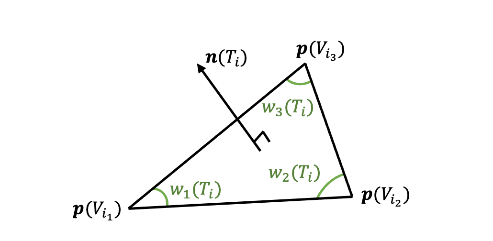
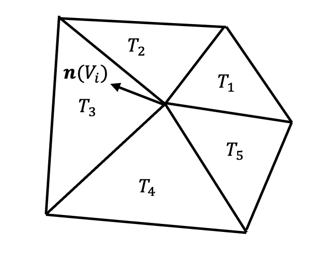
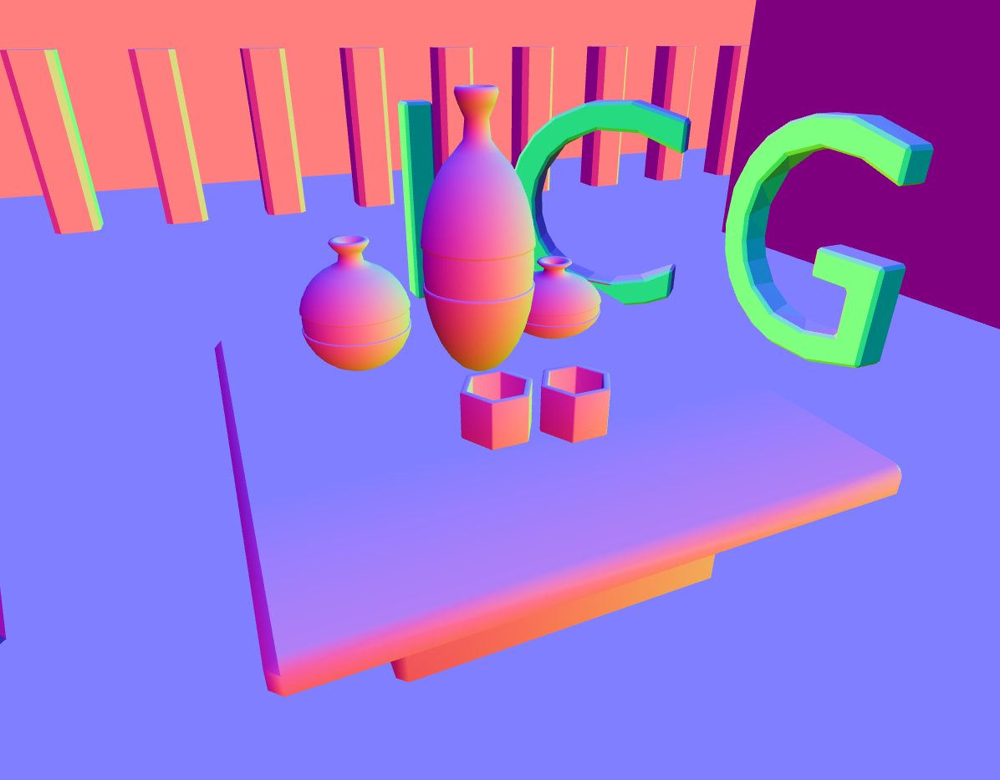
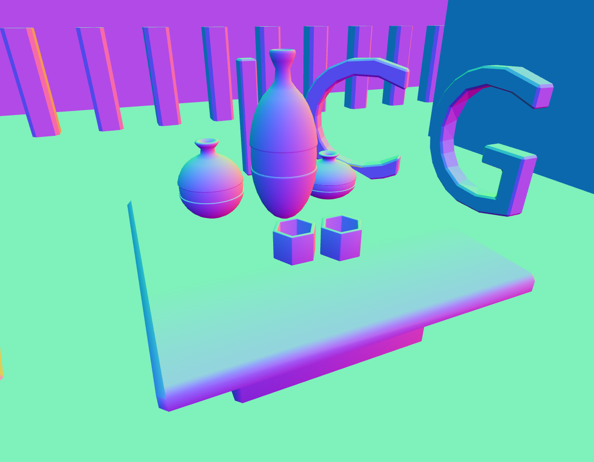
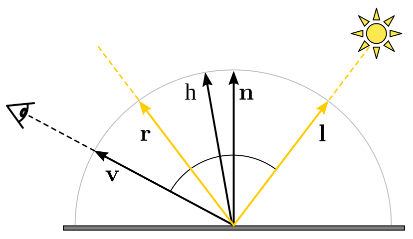
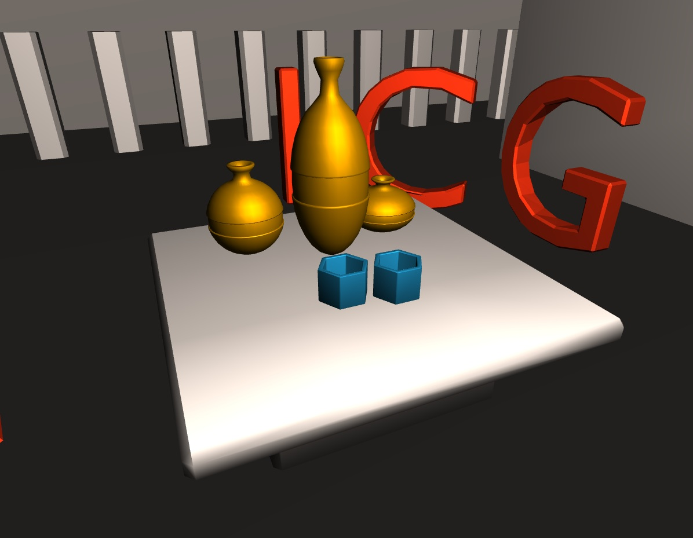

## Computing Vertex Normals in a Triangle Mesh

*Note that we don't have a way to see our normals yet. It might be beneficial to try the start the next part (GL2.2 normal visualization) to debug this task.*

The starting point of this assignment are the functions in the file `normal_computation.js`. Here, you will have to compute the vertex normals weighted by the opening angles, which also requires computing the triangle normals. As you can see, this happens outside the shader so we will be using JS and glMatrix.
When computing normals, you will handle arrays of length 3 which benefit from functions defined for `vec3`. A list of available methods can be found at [this website](https://glmatrix.net/docs/module-vec3.html). As an example, here is how you can compute a cross product between two arrays of length 3:

```js
const a = [1., 0., 0.]
const b = [0., 1., 0.]
const c = vec3.cross([0., 0., 0.], a, b)
// c is equal to [0., 0., 1.]
```

Notice in the above that we need to provide an array as first input to `vec3.cross()`. More generally, for the function listed in the above website, the `out` argument should be replaced by `[0., 0., 0.]`, which serves as a placeholder. 

<figure id="fig-weights"></img></figure>

We now introduce some notation with the [above diagram](#fig-weights). A triangle of the mesh is denoted by $T_i$, and it has 3 vertices $V_{i_1}$, $V_{i_2}$, and $V_{i_3}$. The triangle normal is written $\mathbb{n}(T_i)$, and the weights for the triangle's vertices are $w_{1}(T_i)$, $w_{2}(T_i)$, and $w_{3}(T_i)$. These quantities are what you are expected to compute in a first place. Please note the **orientation** of the normal with respect to the 3 vertices.

<div class="box task">

#### Task GL2.1.1: Compute triangle normals and opening angles

* Fill in the method `compute_triangle_normals_and_angle_weights()` in `normal_computation.js`.
    * Compute the normal vector to each triangle in the mesh
    * Push it into the array `tri_normals`
    * Compute the angle weights for `vert1`, `vert2`, then `vert3` and store it into an array `[w1, w2, w3]`
    * Push this array into `angle_weights`

*Hint*: you can use `vec3` specific methods such as `normalize()`, `add()`, `cross()`, `angle()`, or `subtract()`.
        The absolute value of a float is given by `Math.abs()`.

</div>

Next, we compute each vertex normal $\mathbf{n}(V_{i_k})$ as an average of incident triangles’ normals $\mathbf{n}(T_i)$, weighted by the opening angle $w_{k}(T_i)$.

<div class="column-left">

$$\mathbf{n}(V_{i_k}) = \dfrac{\sum_{T_i \ni V_{i_k}} w_{k}(T_i) \mathbf{n}(T_i)}{||\sum_{T_i \ni V_{i_k}} w_{i_k}(T_i) \mathbf{n}(T_i)||}$$

</div>
<div class="column-right">

  <figure id="fig-vn"></figure>

</div>

To make your implementation more efficient, instead of traversing through all the neighboring triangles of each vertex, you should loop through all the triangles of the mesh, visiting each triangle $T_i$ only once. For each vertex $V_{i_k}$ of the triangle $T_i$, add the contribution $w_{k}(T_i) \mathbf{n}(T_i)$ to the normal of the vertex $V_{i_k}$ (see the exercise slides). Use the `angle_weights` array you computed in the previous task to get the weights $w_{k}$ for each triangle. After all triangles are visited, you should normalize all computed vertex normals.

<div class="box task">

#### Task GL2.1.2: Compute vertex normals

* Fill in the method `compute_vertex_normals()` in `normal_computation.js`.
	* Go through the triangles in the mesh
    * Add the contribution of the current triangle to its vertices' normal
    * Normalize the obtained vertex normals

</div>


## Visualizing normals

We will construct a very simple GPU pipeline to visualize our normals.

### Copy the camera from GL1

First please copy your turntable camera code from GL1 into `main.js`.

### GPU Pipeline Overview 

Rasterization is performed on a GPU (graphics card). GPUs are specialized in massively parallel processing of mesh geometry and image pixels. They operate according to a specific pipeline, 
[Introduction to the Graphics Pipeline](https://www.gamedev.net/tutorials/programming/graphics/introduction-to-the-graphics-pipeline-r3344/)

A program using the graphics pipeline, like our renderer, is divided into strongly separated and different parts:
some run on the CPU - that is the usual programming we have done elsewhere,
and *"shaders"* - code running on the GPU.
The GPU is often a completely separate device, with its own memory and hardware instructions.
Therefore you will be writing code in these 2 different environments, remembering this will make the exercises easier to understand.

* CPU execution - `.js` files using the [JavaScript](https://developer.mozilla.org/en-US/docs/Web/JavaScript) language, run in the browser.
  * You can print messages to the browser's console using [`console.log('message', value)`](https://developer.mozilla.org/en-US/docs/Web/API/Console/log)
  * You can use the *Debugger* ([Firefox](https://developer.mozilla.org/en-US/docs/Tools/Debugger), [Chrome](https://developers.google.com/web/tools/chrome-devtools/javascript)) to set breakpoints (place where the program pauses) and inspect the variables' values.
  * Operations on vectors and matrices are done with the [gl-matrix](http://glmatrix.net/) library (more below);
  they need an output argument and look like this 
  ```js
  const a_p_b = vec3.add([0, 0, 0], a, b)
  ```
  * Types are not checked ahead of time, errors happen at runtime. Mistakes in mathematical operations often cause the creation of `NaN` values - if you see them, most probably one of the gl-matrix functions did not receive all needed arguments.

* GPU execution - `.glsl` files, using the [GLSL](http://www.shaderific.com/glsl/) language.
  * Operations on vectors and matrices are done using [built-in operators and functions](https://en.wikibooks.org/wiki/GLSL_Programming/Vector_and_Matrix_Operations); look like this
  ```c
  vec3 a_p_b = a + b;
  ```
  * There is no debugger nor variable printing; the output of the shader is the color of a pixel or position of a vertex.
  * The code is compiled before execution, variables are typed and types are checked.


**GPU pipeline inputs**

- *Vertex attributes*: position, normal, texture coordinates...
- *Faces*: triangles of the mesh, stored as triples of indices
- *Uniforms*: data globally available to the GPU programs, it includes textures

**GPU processing steps**

- *Vertex shader*: program executed for each vertex of the mesh, calculates its position in the image, and intermediate variables used by the fragment shader.
- *Fragment shader*: program executed for each output pixel of the mesh, calculates the pixel's output color.

#### Passing values between shaders

Let's look at this example pipeline.
We are passing a variable `my_var` between the vertex shader and the fragment shader.

The fragment shader is executed for each pixel of the drawn triangle.
The value of `my_var` is interpolated with weights to each vertex's value corresponding to its barycentric coordinate.

```js
const regl = createREGL();

// The pipeline is constructed only once!
const draw_pipeline = regl({

	// Vertex attributes - properties of each vertes such as position, normal, texture coordinates...
	attributes: {
		vertex_position: [
			[x1, y1, z1],
			[x2, y2, z2], 
			...
		],
	},

	// Triangles (faces), as triplets of vertex indices
	elements: [
		[0, 1, 2], 
		...
	],
	
	// Uniforms: global data available to the shader
	uniforms: {
		mat_mvp: regl.prop('mat_mvp'),
		matrial_color: regl.prop('material.color'),
	},	

	/* 
	Fragment shader program
	Calculates the color of each pixel covered by the mesh.
	The "varying" values are interpolated between the values 
	given by the vertex shader on the vertices of the current triangle.
	*/
	vert: `
	// Vertex attributes, specified in the "attributes" entry of the pipeline
	attribute vec3 position;
	
	varying vec3 my_var;

	void main() {

		// here we assign to my_var
		my_var = f(position);
		
		gl_Position = mat_mvp * vec4(vertex_position, 1);
	}`,
	
	/* 
	Vertex shader program
	Given vertex attributes, it calculates the position of the vertex on screen
	and intermediate data ("varying") passed on to the fragment shader
	*/
	frag: `
	precision mediump float;
	
	varying vec3 my_var;

	uniform vec3 material_color;

	void main() {
		vec3 color = f2(my_var);
		gl_FragColor = vec4(color, 1.); // output: RGBA in 0..1 range
	}`,
});

// Function run to draw each frame
regl.frame((frame) => {
	// Reset the canvas to black
	regl.clear({color: [0, 0, 0, 1]});
		
	// Execute the declared pipeline
	draw_pipeline({
		mat_mvp: ...,
		material: {
			color: [1., 0., 0.],
		},
	})
});
```

#### Shaders

*Shaders* are programs which run on the GPU.
They have their own language, GLSL, which is quite similar to C, with the added [vector and matrix types](http://www.shaderific.com/glsl-types).  
[GLSL reference](http://www.shaderific.com/glsl/)  
[WebGL reference card](https://www.khronos.org/files/webgl/webgl-reference-card-1_0.pdf) page 3-4

The pipeline contains two shader programs:

- *Vertex shader*: executed for each vertex of the mesh, calculates its position in the image, and intermediate variables used by the fragment shader.
- *Fragment shader*: program executed for each output pixel of the mesh, calculates the pixel's output color.

#### Vertex shader
The vertex shader receives as input the vertex attributes specified in the `attributes:` section.
They have to be declared with the `attribute` keyword.

It can pass per-vertex data to the fragment shader, such variables are specified by the `varying` keyword.
The `varying` values are interpolated between the triangle's three vertices weighted by barycentric coordinates.

The vertex shader writes the vertex *image* coordinates to `gl_Position` which is a `vec4` ([homogenous coordinates](https://en.wikipedia.org/wiki/Homogeneous_coordinates)).

```c
// Vertex attributes, specified in the "attributes" entry of the pipeline
attribute vec3 vertex_position;

// Intermediate value passed on to fragment shader
varying vec3 my_var;

void main() {
	// intermediate value passed on to fragment shader
	my_var = vertex_position.xyz;
	
	// output position [x, y, z, w] in homogenous coordinates
	gl_Position = mat_mvp * vec4(vertex_position, 1);	
}
```

#### Fragment shader
It can receive data from the vertex shader, such variables are specified by the `varying` keyword in both shaders.
The `varying` values are interpolated between the triangle's three vertices weighted by barycentric coordinates.

The fragment shader writes the pixel color to `gl_FragColor` as `vec4(Red, Green, Blue, Opacity)`.

Both vertex and fragment shader have access to the global `uniform` values.

```c
// numerical precision of calculation, no consensus which one to use
precision mediump float; 

// Intermediate value from vertex shader have to be declared in both shaders
varying vec3 my_var;

// Access global values from the uniforms: section
uniform vec3 material_color;

void main() {
	vec3 color = f2(my_var);

	// [R, G, B, 1] in 0..1 range
	gl_FragColor = vec4(color, 1.);
}
```


### Pass normals to fragment shader

<figure id="fig-gl221" class="captioned"></img>
<figcaption>Reference normals visualization for the predefined view when pressing "1"</figcaption></figure>

In the vertex shader `normals.vert.glsl`, our computed normal are given as the attribute `vertex_normal`.
We will store it in a `varying` variable to pass it on from vertex to fragment shader and finally draw it on screen.


<div class="box task">

#### Task GL2.2.1: Pass normals to fragment shader

0. Edit `mesh_render.js` to compute the model-view-projection matrix `mat_mvp`. This follows the last assignment's solution.
1. Edit `normals.vert.glsl` and `normals.frag.glsl`: in both add the declaration of a `varying` variable which will contain the normal.
2. In the vertex shader, set the `varying` value.
3. In the fragment shader, use the value to draw false-color representation of normals. False color is calculated as `normal * 0.5 + 0.5`.
4. Make sure the normal is a valid one. What could have happened to it during interpolation?

</div>


### Transforming the normals

<figure id="fig-gl222" class="captioned"></img>
<figcaption>Reference normals visualization, now transformed to view space, for the predefined view when pressing "1"</figcaption></figure>


We now need to transform the normals into our view space.

The normal-transforming matrix ought to be equal to $(\mathbf{VM})^{-T}$, that is the inverse of transpose of model-view matrix.
More details in the lecture.

<div class="box task">

#### Task GL2.2.2: Transforming the normals

1. Edit `mesh_render.js` and calculate `mat_mvp`, `mat_model_view`, and `mat_normals_to_view`. Normals-to-view is equal to  $(\mathbf{VM})^{-T}$.
2. Edit `normals.vert.glsl` and apply the transformation matrix to the normal vectors.
</div>


## Lighting

In this task, you will implement the Blinn-Phong lighting model and use it to illuminate the scene. 
Recall the general Phong lighting model definition:

<figure id="fig-BlinnPhong" class="captioned"></img>
<figcaption>Half vector $\mathbf{h}$ in Blinn-Phong lighting model.</figcaption></figure>

$$\mathbf{I}_{BP} = \mathbf{I}_a*\mathbf{m}_a + 
\sum_{\mbox{light}\; l} \left[
	\mathbf{I}_l*(\mathbf{m}_d.(\mathbf{n}^T\mathbf{l}) + \mathbf{m}_s.(\mathbf{h}^T\mathbf{n})^s)
\right]$$

where $I$ is the final fragment's intensity, $I_{a}$ is the ambient component of light source, 
$I_{l}$ is diffuse/specular component of the light source, 
$m_{[a|d|s]}$ is the ambient/diffuse/specular component of the material, 
$s$ is the shininess, and $\mathbf{n}, \mathbf{l}, \mathbf{h}, \mathbf{v}$ are the normal, light, half-vector, and view vectors, respectively.
Recall that the diffuse component is only added if $\mathbf{n} \cdot \mathbf{l} > 0$ and the specular component is only added 
if both $\mathbf{n} \cdot \mathbf{l} > 0$ and $\mathbf{n} \cdot \mathbf{h} > 0$.

In our scene, we consider a single point light source --- (see `light_position_world` and `light_color` variables defined in `main.js`).
---which provides the $I_{l}$ component. 
$I_{a}$ is usually thought of as the combined (and dispersed) contribution of all the light sources in the scene.
We'll assume the material components $m_{[d|s]}$ are the same and correspond to the RGB color of the object: `material_color`,
and the ambient component $m_a$ is equal to `material_color * material_ambient`.


### Per-vertex (Gouraud) shading

<figure id="fig-gl23" class="captioned"></img>
<figcaption>Reference Gouraud shading for the predefined view when pressing "1"</figcaption></figure>

In the Gouraud shading model, we compute the lighting value for each **vertex** in the vertex shader, store the resulting color and interpolate it over the drawn triangle.

<div class="box task">

#### Task GL2.3: Gouraud lighting

1. Edit `shade_pervertex.vert.js` to compute the lighting value for each vertex. Please note that the calculations happen in view-space.
To put the vertex position into view space, we apply the model-view matrix (not model-view-projection which goes to *screen* coordinates instead of *view* coordinates).
2. Store the color in a `varying` variable (like with normals visualization).
3. Edit `shade_pervertex.frag.js` to display the resulting color.

</div>


### Per-pixel (Phong) shading

<figure id="fig-gl24" class="captioned"></img>
<figcaption>Reference Phong shading for the predefined view when pressing "1"</figcaption></figure>

Gouraud shading can be really inaccurate. In the example above we can see that the floor is dark.
This is because the floor is composed of really big triangles.
The light values at the far-away corners do not correspond at all to the correct light in the middle of the plane.
Therefore for better accuracy we will compute the shading per pixel, not per vertex.

<div class="box task">

#### Task GL2.4: Phong lighting

1. Edit `shade_perpixel.vert.js`:
  * Setup the `varying` values to pass on to the fragment shader: surface normal, view vector, light vector.
  * Compute the surface normal, view vector, light vector in the vertex shader.
1. Edit `shade_perpixel.frag.js`:
  * Implement the Blinn-Phong formula using the passed on values.
  * Make sure to normalize vectors which might have been affected by interpolation.
  * Display the resulting color.
</div>


## What to submit

A .zip compressed file named `ExerciseGL2-GroupG.zip`, where *N* is the number of the current exercise sheet, and *G* is the number of your group. 
It should contain:

* The files you changed (in this case `src/main.js`, `src/mesh_render.js`, `*.glsl`).
* A `readme.txt` file containing a description of how you solved each part of the exercise (use the same numbers and titles) and whatever problems you encountered.
* Please report individual contributions in your `readme.txt` file, following this scheme (sciper in parentheses):  
Name1 Surname1 (000001): 1/3  
Name2 Surname2 (000002): 1/3  
Name3 Surname3 (000003): 1/3  
We ask you to only report global contributions, there is no need to provide additional details for each sub-task. The three contributions should add up to 1.
* Please put your submission in a `.zip` archive, no `.rar` please.

Submit solutions to Moodle before the deadline. Late submissions receive 0 points!
