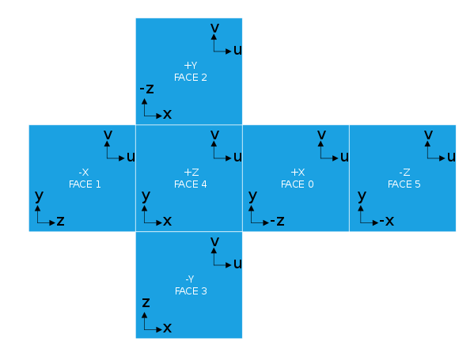
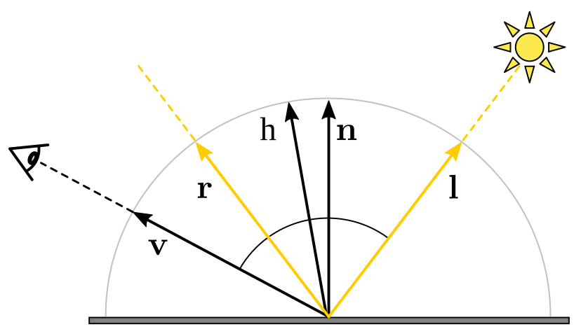
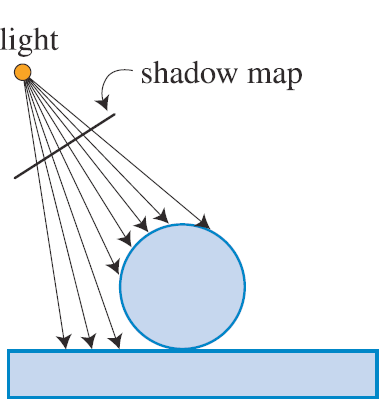

<figure id="fig-teaser" class="captioned"></img>
<figcaption>The image from the previous edition of this exercise. It will be somewhat different this time.</figcaption></figure>


In this assignment, you will implement a real-time shadowing technique for multiple omni-directional point lights.
We will be using a new framework code, but it should seem very familiar to you; it's using the same libraries as the solar system codebase.

## Copy from previous assignment

* Please copy your turntable camera code from GL1 into `main.js`.
* Please complete the `make_transformation_matrices` function in `mesh_render.js` with your solution from GL2 where you set up `mat_mvp`, `mat_model_view` and `mat_normals_to_view`.

## Textures

Textures are an important tool in graphics. They represent per-pixel data such as surface colors, material parameters, or normals.
They are often loaded from image files - you can see the texture files in the `textures` directory.

Let's start by using textures to control the surface color of our objects.

A sky-sphere is a simple technique with spectacular results.
We draw a simple sphere around the scene and color it with a texture representing the 360 degree view of scenery.
There are many background panoramas available at <https://hdri-haven.com> or <https://polyhaven.com/hdris>.

Sampling a texture in GLSL is done with the `texture` function which returns a vec4:

```c
vec2 uv = ...
texture2D(tex_color, uv)
```

We ususally don't need the 4-th component of this vector.

<div class="box task">

#### Task GL3.1.1: Sampling a texture

Edit `shaders/unshaded.frag.glsl` to sample the texture `tex_color` at the UV coordinates passed on from vertex shader
and output the texture's color.

</div>

### Texture (UV) coordinates and wrapping

<figure id="fig-gl31" class="captioned"></img>
<figcaption>We want the tiles to repeat 4 times.</figcaption></figure>


The texture coordinates, often denoted UV, specifies the correspondence between mesh vertices and points on a texture.
In the lecture we have seen how this allows us to map a face mesh onto a flat texture.
Setting the vertex UV coordinates is part of the mesh creation process.

In this section we will modify the UV coordinates of a simple square mesh seen in the middle of the scene.
We colored it with a tile texture, but we would like the tiles to repeat several times.
The mesh UVs to be edited are in `scene.js` `meshes_construct`.
Feel free to play with the UV coordinates and see what happens.

When reading from a texture, we provide the UV sampling coordinates.
The image spans from `[0, 0]` to `[1, 1]` UV coordinates. As you can see, sampling within this range simply displays the image.

What happens when we sample beyond the range? That is decided by the texture wrapping mode.
We have these modes available: clamp, repeat, mirror. [[REGL doc]](https://github.com/regl-project/regl/blob/master/API.md#texture-constructor).
Try them out to see which achieves the desired result.

<div class="box task">

#### Task GL3.1.2: UV coordinates and wrapping modes

1. Edit the UV coordinates of the square mesh in `meshes_construct` in `scene.js` to repeat the texture 4 times.
2. Set the floor texture's wrapping mode in `tex_load_options` in `scene.js` to achieve a tiling floor.

</div>

## Environment mapping

We are going to use environment mapping to achieve real-time reflections and shadows.
An environment map captures a 360 degree view from a given point in the scene.
It is somewhat similar to the sky-sphere texture, but instead of being stored in a single image, it is put in a cube-map.
A cube-map is a 6-sided texture where each side looks in a different direction.

### Cube Maps

Because we are working with **omnidirectional** point lights, our situation 
is a bit more complicated. It's not possible to set up a single view frustum to
render the light rays emanating in all directions. Instead, we will set up $6$
different view frustums---one for each face of an imaginary cube surrounding
our light---and take advantage of the GPU's cube-mapping functionality.

One such frustum together with its corresponding shadow map is depicted
in Figure below. Please note that, when the eye is placed
inside the light cube to render the shadow map, we will refer to it as the
**light camera** to distinguish it from the viewpoint
used to render the image on screen.

<figure class="captioned">
    
    <figcaption class='justified'>
    Figure 1.
    (a) The shadow cube map for the omnidirectional point light source $\mathbf{L}$.
    It is necessary to render a separate shadow map texture for each of the six cube faces.
    Here, the setup for rendering `face 3`'s map is visualized. The
    coordinate axes indicate the orientation of the light camera used to render the shadow map;
	as usual for OpenGL, the camera looks along the -`z axis`.
    (b) The resulting shadow map texture (darker is closer).
    </figcaption>
</figure>

A cube map texture is really a collection of $6$ textures that are
conceptually attached to the faces of a cube. Instead of sampling this cube map
with 2D texture coordinates $(s, t)$, you sample it with a 3D vector $(s, t, r)$;
the GPU then returns the color of the point on the cube where this 3D vector
pierces through:

<figure>

</figure>

This sampling mechanism is a perfect fit for our shadow mapping problem: if we sample the
cube map with the shadow ray vector pointing from the light to $\mathbf{p}$, it will
pull out the intersection distance value for this ray (as long as
we correctly rendered each face's shadow map).

The $6$ texture images making up the cube map are oriented as follows:

<figure class="captioned">
    
	<figcaption class='justified'>
    Figure 2. Cube mapping texture coordinate systems (from [Wikipedia](https://en.wikipedia.org/wiki/Cube_mapping))
	</figcaption>
</figure>


They are wrapped around the cube as shown in Figure 2.
An example of how these shadow maps will be drawn is shown in Figure 1.

<figure class="captioned">
    
	<figcaption class='justified'>
    Figure 3. (a) Names of the shadow map cube faces used in this assignment.
    (b-d) Example of the light camera coordinate axes oriented to render faces 0, 2, and 4, respectively.
	</figcaption>
</figure>


### Building View and Projection Matrices for a Cube Face

<figure id="fig-gl322" class="captioned"></img>
<figcaption>Reference result for cube-map setup and reflections.</figcaption></figure>


Start by constructing the `cube_camera_projection` matrix in `env_capture.js`.

Note that the shadow
map cube model assumes the light is positioned at the center of the cube.
Given such a geometry, think of what aspect ratio and field of view properly define
the light camera's view frustum as visualized in Figure 1.
The near/far parameters control the minimum and maximum distances at which you
can compute shadow ray intersections. For this scene, you can use $0.1$ and $200$
respectively.

<div class="box task">

#### Task GL3.2.1: Projection matrix for a cube camera

Complete the function `init_capture` in `env_capture.js`. Use `mat4.perspective` to produce the projection matrix
for a camera whose center lies at the center of a cube and whose image plane is a cube wall.
Choose the correct field-of-view angle and aspect ratio.
</div>


Next, the `cube_camera_view` function constructs the view matrix
for the light camera looking through side `side_idx` (in 0..5) of the shadow map cube.
This the matrix representing the transformation from the world coordinate
system to the coordinate system for the light camera.

Note that the orientation of the shadow map cube
itself (i.e., the shadow map cube coordinate system) must always be aligned with current
eye coordinate system (see Figure 3 (a))! This will allow you
sample the cube map texture directly with the light vectors calculated in your
Phong shader (since your lighting calculation is done in eye space).
Therefore, the `cube_camera_view` matrix uses the current eye's view matrix.

We are also using the function `mat4.lookAt` to
point the camera through the specified cube face. See Figure 3 (b-d) for
example light camera orientations.

Please set up the `up` vectors for the `lookAt` function for each face by studying Figure 2.


<div class="box task">

#### Task GL3.2.2: Up vectors for cube camera

Edit the up vectors `CUBE_FACE_UP` in `env_capture.js` to point the camera through the specified cube faces.
Please check that your scene capture visualization (bottom left) matches the reference image.
</div>


### Reflections from environment capture

<figure id="fig-phong-reflection" class="captioned"></img>
<figcaption>Reflected ray direction.</figcaption></figure>


In the previous part we have captures a view from a particular point in the scene into a cubemap.
Sampling this cube-map allows us to recover the light ray coming from that direction.
We will use it to implement real-time reflections.

The idea is similar to reflections in assignment RT2.
There we could run the ray tracer to shoot a ray in any direction.
In the rasterization pipeline we have to draw whole objects from a fixed viewpoint.
Thus the environment-map will serve as an approximation of the ability to shoot rays.

The approximation relies on an assumption that the shiny object is small compared to the whole scene.
We capture the view from the center of the object and hope that it is not significantly different from the view from the object's surface.

Sampling a cube-map is similar to sampling a texture but takes a 3D vector instead of 2D UV:

```c
vec4 result = textureCube(cube_env_map, direction_vec3);
```

<div class="box task">

#### Task GL3.2.3: Reflection shader

Edit the reflection shaders `mirror.vert.glsl` and `mirror.frag.glsl` to implement the environment-map based reflections.

1. Pass the view-space normals and viewing-direction from the vertex shader to the fragment shader.
This is a slight adaptation of your solution for GL2. Normalize vectors which ought to be unit vectors.
2. Calculate the reflected ray direction $\mathbf{r}$ in your fragment shader, then sample the cube-map to get the color of the reflected ray.
Please consult assignment RT2 for the discussion on reflections.

</div>


## Shadow Mapping

### Review on Phong Lighting and Shadows

Recall the Phong illumination model you've used in the previous assignments:


<figure id="fig-BlinnPhong" class="captioned"></img>
<figcaption>Half vector $\mathbf{h}$ in Blinn-Phong lighting model.</figcaption></figure>

$$\mathbf{I}_{BP} = \mathbf{I}_a*\mathbf{m}_a + 
\sum_{\mbox{light}\; l} \left[
	\mathbf{I}_l*(\mathbf{m}_d.(\mathbf{n}^T\mathbf{l}) + \mathbf{m}_s.(\mathbf{h}^T\mathbf{n})^s)
	\frac{1}{dist(l, p)^2}
\right]
$$


<!-- { width=60% #fig:singleShadowma } -->

where the final fragment's intensity, $I$, is computed adding specular and diffuse contributions from each light, $l$,
atop the ambient contribution. Here
$I_{a}$ is the ambient light intensity, $I_{l}$ is diffuse/specular intensity of light source $l$,
$m_{[a|d|s]}$ is the ambient/diffuse/specular component of the material, $s$ is
the shininess, and $\mathbf{n}, \mathbf{l}, \mathbf{h}, \mathbf{v}$ are the
normal, light, half-vector, and view vectors respectively.

*In this implementation, we simplify `m_s = m_d = material_color` where the color is sampled from a provided texture.
We set `m_a = 0.1`.*

Remember that, in the second raytracing assignment, you computed shadows by
neglecting the contributions from lights that are obscured by other scene
geometry. To do this, you cast a **shadow ray** from the point being lit,
\'\'$\mathbf{p}$\'\', to the light to check if there was an intersection between the two.

An equivalent formulation of this test, which we will see is more compatible with
the WebGL/regl rasterization pipeline, is to instead cast a ray from the light toward the point and check
if there is any intersection **closer** to the light than ${\mathbf{p}}$ is. If so, then ${\mathbf{p}}$
is in a shadow, and no diffuse or specular components from this light should be added.

<figure class="row">
{ width=35% }
{ width=35% }
</figure>

## Real-time Shadows with Shadow Mapping
The nice thing about this new shadow test formulation is that determining the first intersection
of a whole frustum of rays with a scene is exactly the problem GPU rasterization pipeline solves: we can
simply render the scene from the perspective of the light to determine the
distance of the closest intersection along every light ray. The resulting
grayscale image of distance values is called a shadow map:

<figure class="row center">
    { width=35% }
    { width=35% }
</figure>
<figcaption>
    From Akenine-Moller, "Real-Time Rendering."
</figcaption>

Then, when computing the lighting for point $\mathbf{p}$, we can compare its distance from the light
against the corresponding ray's intersection distance value stored in this shadow
map. This test involves only an efficient, constant-time texture look-up operation.

Shadow mapping implementations traditionally store the depth buffer (or
`z-buffer`) value in the shadow map.
However, for omnidirectional lighting, it will be simpler to instead work with
**the Euclidean distance from the light to the intersection point**.
When we switch to the shadow mode, the cubemap visualizer shows the shadow map.


With this approach, we need the following multi-pass rendering process:

```
for all rasterized framgents p:
	I(p) <- ambient_contribution

for all lights l in the scene:
	draw shadow map for l by computing distances to each fragment seen by l
	for all rasterized fragments p:
		if length(p - l.pos) < shadowmap_depth:
			I(p) <- I(p) + diffuse_contribution(p, l)
			I(p) <- I(p) + specular_contribution(p, l)

```

<!-- <script src="doc/pseudocode.min.js"></script>
<div style='width: 70%; margin: 0 auto;'>
<pre id="shadowmapPseudocode" style="display:hidden;">
\begin{algorithm}
\caption{Phong Lighting with Shadow Maps}
\begin{algorithmic}
	\ForAll{rasterized fragments ``$\mathbf{p}$''}
		\State $I(\mathbf{p}) \gets \texttt{ambient\_contribution}$
	\EndFor
	\For{lights $l$ in the scene}
		\State Draw shadow map for $l$ by computing distances to each fragment seen by $l$
		\ForAll{rasterized fragments ``$\mathbf{p}$''}
			\If{$\texttt{length}(\mathbf{p} - l.\texttt{pos}) < \texttt{shadowmap\_depth}$} 
				\State $I(\mathbf{p}) \gets I(\mathbf{p}) + \texttt{diffuse\_specular\_contribution}$
			\EndIf
		\EndFor
	\EndFor
\end{algorithmic}
\end{algorithm}
</pre>
</div>
<script>
pseudocode.renderElement(document.getElementById("shadowmapPseudocode"));
</script>-->
<!-- 
<div style="margin: 0 auto;">
<div class="ps-root">
<div class="ps-algorithm with-caption">
<p class="ps-line" style="text-indent:-1.2em;padding-left:1.2em;">
<span class="ps-keyword">Algorithm 1 </span>Phong Lighting with Shadow Maps</p>
<div class="ps-algorithmic">
<div class="ps-block" style="margin-left:1.2em;">
<p class="ps-line ps-code">
<span class="ps-keyword">for all </span>rasterized fragments ‘‘<span class="katex"><span class="katex-mathml"><math xmlns="http://www.w3.org/1998/Math/MathML"><semantics><mrow><mi mathvariant="bold">p</mi></mrow><annotation encoding="application/x-tex">\mathbf{p}</annotation></semantics></math></span><span class="katex-html" aria-hidden="true"><span class="base"><span class="strut" style="height:0.63888em;vertical-align:-0.19444em;"></span><span class="mord"><span class="mord mathbf">p</span></span></span></span></span>’’<span class="ps-keyword"> do</span></p>
<div class="ps-block" style="margin-left:1.2em;">
<p class="ps-line ps-code">
<span class="katex"><span class="katex-mathml"><math xmlns="http://www.w3.org/1998/Math/MathML"><semantics><mrow><mi>I</mi><mo stretchy="false">(</mo><mi mathvariant="bold">p</mi><mo stretchy="false">)</mo><mo>←</mo><mtext mathvariant="monospace">ambient_contribution</mtext></mrow><annotation encoding="application/x-tex">I(\mathbf{p}) \gets \texttt{ambient\_contribution}</annotation></semantics></math></span><span class="katex-html" aria-hidden="true"><span class="base"><span class="strut" style="height:1em;vertical-align:-0.25em;"></span><span class="mord mathdefault" style="margin-right:0.07847em;">I</span><span class="mopen">(</span><span class="mord"><span class="mord mathbf">p</span></span><span class="mclose">)</span><span class="mspace" style="margin-right:0.27em;"></span><span class="mrel">←</span><span class="mspace" style="margin-right:0.27em;"></span></span><span class="base"><span class="strut" style="height:0.70625em;vertical-align:-0.09514em;"></span><span class="mord text"><span class="mord texttt">ambient_contribution</span></span></span></span></span></p>
</div>
<p class="ps-line ps-code">
<span class="ps-keyword">end for</span></p>
<p class="ps-line ps-code">
<span class="ps-keyword">for </span>lights <span class="katex"><span class="katex-mathml"><math xmlns="http://www.w3.org/1998/Math/MathML"><semantics><mrow><mi>l</mi></mrow><annotation encoding="application/x-tex">l</annotation></semantics></math></span><span class="katex-html" aria-hidden="true"><span class="base"><span class="strut" style="height:0.69444em;vertical-align:0em;"></span><span class="mord mathdefault" style="margin-right:0.01968em;">l</span></span></span></span> in the scene<span class="ps-keyword"> do</span></p>
<div class="ps-block" style="margin-left:1.2em;">
<p class="ps-line ps-code">
Draw shadow map for <span class="katex"><span class="katex-mathml"><math xmlns="http://www.w3.org/1998/Math/MathML"><semantics><mrow><mi>l</mi></mrow><annotation encoding="application/x-tex">l</annotation></semantics></math></span><span class="katex-html" aria-hidden="true"><span class="base"><span class="strut" style="height:0.69444em;vertical-align:0em;"></span><span class="mord mathdefault" style="margin-right:0.01968em;">l</span></span></span></span> by computing distances to each fragment seen by <span class="katex"><span class="katex-mathml"><math xmlns="http://www.w3.org/1998/Math/MathML"><semantics><mrow><mi>l</mi></mrow><annotation encoding="application/x-tex">l</annotation></semantics></math></span><span class="katex-html" aria-hidden="true"><span class="base"><span class="strut" style="height:0.69444em;vertical-align:0em;"></span><span class="mord mathdefault" style="margin-right:0.01968em;">l</span></span></span></span></p>
<p class="ps-line ps-code">
<span class="ps-keyword">for all </span>rasterized fragments ‘‘<span class="katex"><span class="katex-mathml"><math xmlns="http://www.w3.org/1998/Math/MathML"><semantics><mrow><mi mathvariant="bold">p</mi></mrow><annotation encoding="application/x-tex">\mathbf{p}</annotation></semantics></math></span><span class="katex-html" aria-hidden="true"><span class="base"><span class="strut" style="height:0.63888em;vertical-align:-0.19444em;"></span><span class="mord"><span class="mord mathbf">p</span></span></span></span></span>’’<span class="ps-keyword"> do</span></p>
<div class="ps-block" style="margin-left:1.2em;">
<p class="ps-line ps-code">
<span class="ps-keyword">if </span><span class="katex"><span class="katex-mathml"><math xmlns="http://www.w3.org/1998/Math/MathML"><semantics><mrow><mtext mathvariant="monospace">length</mtext><mo stretchy="false">(</mo><mi mathvariant="bold">p</mi><mo>−</mo><mi>l</mi><mi mathvariant="normal">.</mi><mtext mathvariant="monospace">pos</mtext><mo stretchy="false">)</mo><mo>&lt;</mo><mtext mathvariant="monospace">shadowmap_depth</mtext></mrow><annotation encoding="application/x-tex">\texttt{length}(\mathbf{p} - l.\texttt{pos}) &lt; \texttt{shadowmap\_depth}</annotation></semantics></math></span><span class="katex-html" aria-hidden="true"><span class="base"><span class="strut" style="height:1em;vertical-align:-0.25em;"></span><span class="mord text"><span class="mord texttt">length</span></span><span class="mopen">(</span><span class="mord"><span class="mord mathbf">p</span></span><span class="mspace" style="margin-right:0.22em;"></span><span class="mbin">−</span><span class="mspace" style="margin-right:0.22em;"></span></span><span class="base"><span class="strut" style="height:1em;vertical-align:-0.25em;"></span><span class="mord mathdefault" style="margin-right:0.01968em;">l</span><span class="mord">.</span><span class="mord text"><span class="mord texttt">pos</span></span><span class="mclose">)</span><span class="mspace" style="margin-right:0.27em;"></span><span class="mrel">&lt;</span><span class="mspace" style="margin-right:0.27em;"></span></span><span class="base"><span class="strut" style="height:0.833em;vertical-align:-0.22em;"></span><span class="mord text"><span class="mord texttt">shadowmap_depth</span></span></span></span></span><span class="ps-keyword"> then</span></p>
<div class="ps-block" style="margin-left:1.2em;">
<p class="ps-line ps-code">
<span class="katex"><span class="katex-mathml"><math xmlns="http://www.w3.org/1998/Math/MathML"><semantics><mrow><mi>I</mi><mo stretchy="false">(</mo><mi mathvariant="bold">p</mi><mo stretchy="false">)</mo><mo>←</mo><mi>I</mi><mo stretchy="false">(</mo><mi mathvariant="bold">p</mi><mo stretchy="false">)</mo><mo>+</mo><mtext mathvariant="monospace">diffuse_specular_contribution</mtext></mrow><annotation encoding="application/x-tex">I(\mathbf{p}) \gets I(\mathbf{p}) + \texttt{diffuse\_specular\_contribution}</annotation></semantics></math></span><span class="katex-html" aria-hidden="true"><span class="base"><span class="strut" style="height:1em;vertical-align:-0.25em;"></span><span class="mord mathdefault" style="margin-right:0.07847em;">I</span><span class="mopen">(</span><span class="mord"><span class="mord mathbf">p</span></span><span class="mclose">)</span><span class="mspace" style="margin-right:0.27em;"></span><span class="mrel">←</span><span class="mspace" style="margin-right:0.27em;"></span></span><span class="base"><span class="strut" style="height:1em;vertical-align:-0.25em;"></span><span class="mord mathdefault" style="margin-right:0.07847em;">I</span><span class="mopen">(</span><span class="mord"><span class="mord mathbf">p</span></span><span class="mclose">)</span><span class="mspace" style="margin-right:0.22em;"></span><span class="mbin">+</span><span class="mspace" style="margin-right:0.22em;"></span></span><span class="base"><span class="strut" style="height:0.833em;vertical-align:-0.22em;"></span><span class="mord text"><span class="mord texttt">diffuse_specular_contribution</span></span></span></span></span></p>
</div>
<p class="ps-line ps-code">
<span class="ps-keyword">end if</span></p>
</div>
<p class="ps-line ps-code">
<span class="ps-keyword">end for</span></p>
</div>
<p class="ps-line ps-code">
<span class="ps-keyword">end for</span></p>
</div>
</div>
</div>
</div>
</div> -->

<!-- `src/shaders/ambient_color.frag.glsl` and -->

In our implementation, the loops over rasterized fragments will be executed by 
the fragment shader
`src/shaders/phong_shadow.frag.glsl`. The shadow map distance values are written
by `..src/shaders/shadowmap_gen.frag.glsl`.

### Shaders and Blend Options

<!-- ### TASK 6.2.1: Light Depth Fragment Shader
In `src/shaders/shadowmap_gen.frag.glsl`, finish the todo item `6.2.1`, calculating the fragment distance.

Note that the `shadowmap_gen` fragment shader should write the **Euclidean distance** to the
fragment instead of its z (depth) coordinate.

After completing this task,
you can verify your implementation by pressing the `c` key and comparing with the ground-truth
shadow maps:

{ width=50% }

---------------- -->

<div class="box task">

#### Task GL3.3.1: Phong Lighting Shader with Shadows

Edit `shaders/phong_shadow.vert.glsl` and `shaders/phong_shadow.frag.glsl` to implement Phong lighting with shadows.
It is quite similar to the Blinn-Phong shader from GL2 but with several differences:

* We pass the *fragment position in camera space* (`mat_model_view * vpos`) to the fragment shader.
We will use it in the fragment shader to calculate the *view direction*, *lighting direction*, and *distance between fragment and light*.
Therefore we no longer need to pass view and lighting directions to the fragment shader.
* To simulate the attenuation of light emitted from a point source over distance, please
scale the light color by the inverse squared distance from the light to the fragment.
Note that the given `light_color`s have high values to account for the attenuation.
Without the attenuation implemented, your image will be oversaturated.
* Use the `cube_shadowmap` shadow map to test whether the fragment is under shadow; 
your shader should only output a nonzero color if  the light is visible from the fragment. 
You can use the GLSL function `textureCube` to sample the cube map texture using a vector.
Mitigations against shadow acne might be needed.

</div>


### Adding the light contributions

<div class="box task">

#### Task GL3.3.2 Blend Options

In `mesh_render.js`, `SysRenderMeshesWithLight::init_pipeline` set the blending mode of the pipeline.
</div>

We need each iteration of our loop over the lights to **add** to the
current image, not overwrite it. This can be accomplished by enabling blending
and appropriately configuring the blend function. You will want to change the `blend`
field to look like:
```
		blend: {
			enable: true,
			func: {
				src: sfactor,
				dst: dfactor,
			},
		},
```
which corresponds to a call to the OpenGL function `glBlendFunc(sfactor, defactor)`. 
To determine the correct arguments to pass as `sfactor` and `dfactor`, please study the [OpenGL reference page](https://www.khronos.org/registry/OpenGL-Refpages/gl4/html/glBlendFunc.xhtml)
and think about how to make the blend operation *add* the source and destination
values. You may also find it useful to read the `regl` documentation on blending [here](http://regl.party/api#blending).

Now, with this last task finished, you should see the following result:

<figure id="fig-gl331" class="captioned"></img>
<figcaption>Result of shadow implementation.</figcaption></figure>


<!-- { width=75% } -->

## What to submit

A .zip compressed file named `ExerciseGL3-GroupG.zip`, where *N* is the number of the current exercise sheet, and *G* is the number of your group.
It should contain:

* Your source files.
* A couple of screenshots clearly showing that you can render the proper shadows from multiple viewpoints.
* Please report individual contributions in your `readme.txt` file, following this scheme (sciper in parentheses):  
Name1 Surname1 (000001): 1/3  
Name2 Surname2 (000002): 1/3  
Name3 Surname3 (000003): 1/3  
We ask you to only report global contributions, there is no need to provide additional details for each sub-task. The three contributions should add up to 1.
* Please put your submission in a `.zip` archive, no `.rar` please.

Submit solutions to Moodle before the deadline. Late submissions receive 0 points!

<!-- <div class="box grade"> -->

