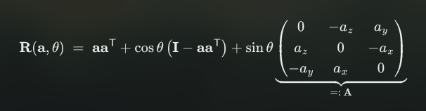

# Week 2: Ray-tracing

`Raster Image` 2D array of pixels 
> Pixel = short for *picture element*

Light Transport Assumptions
- Geometric optics: Light propagates along rays, not waves  
    -> no diffraction, no interference, no polarization
- RGB approximation: Approximate light spectrum by discrete RGB wavelengths  
    -> no dispersion, no fluorescence
- No participating media: Light travels along straight rays through vacuum  
    -> no atmospheric scattering, no gravity effects
- Superposition: Simply add multiple light contributions  
    -> No non-linearly reflecting materials

## Basic Ray Tracing Pipeline

Ray generation  <-  
    v            |  
Ray intersection |  
    v            |  
Lighting        >-  

```js
void raytrace()
{
    for (int x=0; x<width; ++x)
    {
        for (int y=0; y<height; ++y)
        {
            // generate primary ray through pixel (x,y)
            ray = primary_ray(x,y);

            // determine color through (recursive!) trace function
            color[x,y] = trace(ray);
        }
    }
}
```
## Ray-Surface Intersections

    r(t) = o + td

$x^Ty = cos(\theta)||x|| ||y||$
=> $\theta = acos(\frac{x^Ty}{||x|| ||y||})$

Unit sphere
$(\phi, \theta) -> c + r(cos \phi cos \theta, sin \phi cos \theta, sin \theta)$ 

### Ray-sphere Intersection  

$o + td = c + r(cos \phi cos \theta, sin \phi cos \theta, sin \theta)$  
which we have to solve for t, $\phi$ and $\theta$  
> Trigonometric functions make this equation nonlinear and complicated!

**2nd try**

||x - c|| - r = 0  
||o + td - c|| - r = 0  
and solve for t  
> Much easier and more efficient!

### Ray-Plane Intersection

$n^T(x - c) = 0$  
Using $d = n^Tc$  
$n^Tx - d = 0$

$n^T(o + td) - d = 0$

---

# Week 3: Lighting

## Surface Reflectance

> How much light is leaving point x in direction $w_{out}$ ?

Collect incoming light $L_in$ from all directions $w_{in} \in \Omega$  
$L_{out}(w_out) = \int_\Omega f(w_{in}, w_{out}) L_{in}(w_{in}) cos(\theta_{in}) dw_{in}$


## Bidirectional Reflectance Distribution Function

> How much light coming in from direction $w_{in}$ is reflected out in direction $w_{out}$ ?

Determined by the object's BRDF  
-> General description of an object's material

## Ray-tracing approximations


Ray Tracing approximates integral by three directions
- directions toward light sources, directions of perfect reflection and perfect refraction

Phong Lighting approximates BRDF by three components
- ambient light, diffuse reflection, specular reflection
- Phong Lighting handles direct, local illumination only

### Phong Lighting Model

Ambient lighting
- approximate global light transport / exchange
- uniform in, uniform out

Diffuse lighting
- dull / mat surfaces
- directed in, uniform out

Specular lighting
- shiny surfaces
- directed in, directed out

`Ambient Light` $I = I_a m_a$  
Ia:ambient light intensity in the scene  
ma: material’s ambient reflection coefficient


`Diffuse (Lambertian) Reflection` $I = I_l m_d cos \theta = I_l m_d (n \cdot l)$   
Il: intensity of light source l  
md: material's diffuse reflection coefficient  
n and l normalized  
no illumination if $n \cdot l < 0$

- Intensity inversely proportional to illuminated area
- Illuminated area inversely proportional to
- Therefore intensity proportional to 

`Specular Reflection` $I = I_l m_s cos^s(\alpha) = I_l m_s (r \cdot v)$  
Il: intensity of light source l  
ms: material's specular reflection coefficient  
all directions normalized
no illumination if $n \cdot l < 0$ or $r \cdot v < 0$
s: cosine exponent controls shininess

$r = l + 2s$  
$s = -l + n (n \cdot l)$  
$r = 2n (n \cdot l) - l$

### Blinn-Phong Model (better and simpler)

`Half-way vector`
$h = \frac{l + v}{||l + v||}$

`Specular component`
$I = I_l m_s (n \cdot h)^s$

## Shadows

Discard diffuse and specular contribution if light is blocked by another object.

$I = I_a m_a + \sum_l I_l \cdot shadow(x, x_l) \cdot (m_d (n \cdot l_l) + m_s (r_l \cdot v)^s)$

> Floating point errors might lead to erroneous self-shadowing (shadow acne).  
> Discard intersection points of the shadow ray that are too close to the ray origin (the point on the sphere that we want to test).

## Recursive Ray-tracing

$w_{out} = (I - 2nn^T) w_{in}$

`Snell's law` $n_1 sin \theta_1 = n_2 sin \theta_2$

Which light paths can a standard recursive ray-tracer handle?  
Only E[S*](D|G)L

# Week 4: Rendering Pipeline


Shading
- flat (constant)
- per-vertex (Gouraud)
- per-fragment (Phong)

`OpenGl` Computer graphics rendering API 

## Transformations

`2D translation` $(x, y) => (x + t_x, y + t_y)$  
`2D scaling` $(x, y) => (s_x \cdot x, s_y \cdot y)$  
`2D rotation` $(x, y) => (r cos(\phi + \theta), r sin(\phi + \theta)) 
= \begin{pmatrix}
cos \theta & -sin \theta\\
sin \theta & cos \theta
\end{pmatrix} \cdot
\begin{pmatrix}
x \\ y
\end{pmatrix}
$  


How to rotate/scale around object center?
1. Translate center to origin
2. Scale object
3. Rotate object
4. Translate center back

> How to efficiently combine several transformations?  

Represent transformations as matrices!

> Every linear transformation $L:\mathbb{R}^n \rightarrow \mathbb{R}^n$ can be
written as a unique (n x n) matrix L whose columns are the images of the basis vectors {e_1, ..., e_n}

$L(x) = L(x_1e_1 + x_2e_2 + ... + x_ne_n)$

`Linear transformations` preserve the origin  
=> Translation is not a linear mapping, it is an `affine transformation` (linear + translation)

$(x, y) \rightarrow 
\begin{pmatrix}
a & b \\
c & d
\end{pmatrix}
\cdot (x, y) + (t_x, t_y) = Lx + t$

> How to represent translations as matrices?

Extend cartesian coordinates (x,y) to homogeneous coordinates (x,y,w)  
- Points are represented by $(x,y,1)^T$
- Vectors are represented by $(x,y,0)^T$

$\begin{pmatrix}
1 & 0 & a \\
0 & 1 & b \\
0 & 0 & 1
\end{pmatrix}$

Matrix representation of arbitrary affine transformation   
$\begin{pmatrix}
a & b \\
c & d
\end{pmatrix}
\cdot (x, y) + (t_x, t_y)
\leftrightarrow
\begin{pmatrix}
a & b & t_x \\
c & d & t_y \\
0 & 0 & 1
\end{pmatrix}
\cdot (x, y, 1)$

Summary


> Concatenate transformations by matrix multiplication 

A matrix M is `orthogonal` iff…
- its columns are orthonormal vectors
- its rows are orthonormal vectors
- its inverse is its transposed: $M^{-1} = M^T$


Orthogonal matrices / mappings…
- preserve angles and lengths
- can only be rotations or reflections
- have determinant +1 or -1

## Rotation around x/y/z axes

Can we compose any 3D rotation from rotations around the axes $R_x, R_y, R_z$ ?  
=> `Euler angles`

Problem: `Gimbal lock` $\beta = 90^o$ => $\alpha$ and $\gamma$ control the same direction

Solution: `Rodrigues Formula`  
Rotation by angle $\theta$ arount normalized axis a



## Transformation Pipeline

`Model coordinates` local coordinate system for each model
`World coordinates` one global coordinate system
`Camera / eye coordinates` world transformed to standard camera


### View Transformation
- setup extrinsic camera parameters: position and orientation

        Transform scene to standard camera
        - Camera/eye location (0,0,0)
        - Viewing direction (0,0,-1)
        - Up direction (0,1,0) 
        - Right direction (1,0,0)

### Projection Transformation
- setup intrinsic camera parameters: opening angle and depth range

        - A mapping from 3D space to a planar 2D image
        - Parallel or perspective projection
        - Transforms viewing volume to normalized device coordinates $[-1,1]^3$ 

`Orthographic Projection`  
Orthogonal projection onto xy-plane

$
\begin{pmatrix}
1 & 0 & 0 & 0 \\
0 & 1 & 0 & 0 \\
0 & 0 & 0 & 0 \\
0 & 0 & 0 & 1 \\
\end{pmatrix}
$
- xy-coordinates do not change
- remove z-coordinate
- keep w-coordinate

`Perspective Projection`
Center of projection (0,0,0)  
Image plane at z = -d


`Frustum Mapping` cut outside image boundaries


### Viewport Transformation
- setup image parameters/resolution: width and height

Simple scaling of normalized device coordinates to window pixel coordinates   
$
\begin{pmatrix}
w/2 & 0 & 0 & w/2 + l \\
0 & h/2 & 0 & h/2 + b \\
0 & 0 & 1/2 & 1/2 \\
0 & 0 & 0 & 1
\end{pmatrix}
$

# Week 5: Meshes

`Barycentric coordinates` Affine combination of 2 points  
$x = \alpha A + \beta B$ with $\alpha + \beta = 1$

`Convex combination` same with $\alpha, \beta \geq 0$  
-> Inside of a triangle for 3 dimensions

## Triangle Meshes

`Valence` number of edges that are incident to the vertex

Triangle meshes:  
F ~= 2V  
E ~= 3V  
Average valence 6

Quad meshes:  
F ~= V  
E ~= 2V  
Average valence 4

Affine transformations preserve affine combinations  
=> Triangles are transformed to triangles

`Triangle normal`
$n(T) = \frac{(b - a) \times (c - a)}{||(b - a) \times (c - a)||}$

`Vertex normal`  
Average of incident's triangles' normals  
Weighted by area or opening angle $w(T_i)$

`Clipping` removes everything outside the viewing frustum

## Rasterization

### Line Rasterization

Discretize line from $(x_0, y_0)$ to $(x_1, y_1)$ to pixel grid

**Bresenham Algorithm**
```js
Δx  = x1-x0;
Δy  = y1-y0;
d   = 2*Δy - Δx;
ΔE  = 2*Δy;
ΔNE = 2*(Δy - Δx);

set_pixel(x0, y0);

for (x = x0, y = y0; x <= x1;)
{
    if (d <= 0) { d += ΔE;  ++x;      }
    else        { d += ΔNE; ++x; ++y; }
    set_pixel(x, y);
}
```
$+$ only integer arithmetic -> efficient

### Triangle Rasterization

Compute horizontal spans in each scanline  
-> Compute the intersections with triangle edges, fill all pixels inbetween

### Shading

Flat Shading
- Compute lighting per face
- Facetted appearance

Gouraud Shading
- Compute lighting per vertex
- Linear interpolation of colors
- Might loose small highlights

Phong Shading
- Linear interpolation of vertex normals
- Compute lighting per pixel
- Captures small highlights

`Z-Buffer` store current minimum z-value for each pixel   
-> Weird glitches when planes overlap

# Week 6: Textures

Textures allow us to model many surface properties:

- material (diffuse + specular colors/coefficients)
- normal vector (normal mapping, bump mapping)
- geometry (displacement mapping)
- opacity (alpha mapping)
- reflection/illumination (environment mapping)

> Linear interpolation in world coordinates yields nonlinear interpolation in screen coordinates!

**Solution**: Interpolate texture coordinates by barycentric coordinates in 3D object space

## Texture Interpolation

### Magnification

Round to nearest

Bilinear interpolation of neighboring texture pixels

```js
color = (1-s)*(1-t)*tex[6,3] + (1-s)*t*tex[6,4]
           s*(1-t)*tex[7,3] +     s*t*tex[7,4];
```

### Minification

Point sampling is the wrong model
- Texture minification leads to aliasing

Integrate over image pixel’s area in texture space
- Approximated by an ellipse
- Elliptically weighted averaging (`EWA filtering`)

Approximate EWA filtering by
- mip-mapping
- anisotropic texture filtering

`Mip-Mapping`

Store texture at multiple levels-of-detail
- MIP means “multum in parvo”: many in a small space.
- Precompute down-scaled versions of texture image

Use lower-resolution versions when far from camera
- OpenGL picks the most suitable image resolution for each
- per-pixel texture lookup based on pixel’s depth value

### Environment Maps

Cube Environment Maps have less distorsion than Spherical ones but require storing 6 images

### Bump Maps vs Normal Maps

Bump mapping
- Perturb normal based on height field texture
- Tangents and bitangents can be approximated in pixel shader (see here)
- Have to store one channel only

Normal mapping
- Store normal perturbation in RGB texture (need three channels)
- Tangents and bitangents can be approximated in pixel shader (see here)
- Accurate reproduction of normals
- Generally preferred, unless memory is tight

### Normal Maps vs Displacement Maps

Normal mapping
- Don’t change geometry, only change normals based on texture
- Can be performed in pixel shader
- Silhouette still looks wrong

Displacement mapping
- Displace vertices based on offset stored in texture
- Compute normal vectors of displaced surface
- Performed in geometry shader or tesselation shader - not supported by WebGL!
- Silhouette looks ok, but much more expensive to compute

## Shadow Mapping

> If a light source is occluded, simply skip its diffuse and specular contribution

### Shadow Maps


1. Render scene as seen from light source
- Store z-buffer (holds distance to light)
- Light’s z-buffer is called shadow map

2. Render scene from eye point
- Light a certain image plane pixel (x,y)?
- Map it back into word coordinates: (x',y',z')
- Project it into shadow map: (x",y")
- If distance point-to-light > depth stored in map
    - Point is in shadow!

OpenGL Implementation

    Render scene with ambient lighting only
        Update frame- and z-buffer
    For each light source
        Render scene from light source
            Store z-buffer in shadow map
        Render scene with light contribution (accumulate)
            Shadow map look-up for each pixel
            Pixels in shadow are discarded
            Other pixels are lit and rendered

# Week 7: Procedural Modeling

Why?
- abstraction
- automatic generation
- compact representations
- infinite detail
- parametric control
- flexibility


More Problems with Acquired Textures
- Physical extent limited by storage size
    - Particularly problematic for solid textures...
- Repeating to fill more space causes visible artifacts:


Problems with Pure Randomness
- Neighboring samples are uncorrelated
    - Natural phenomena lead to more structure
- Get a different result every time
    - When an artist finishes setting up a scene, they don’t want it to change.

## Noise Functions

Function $\mathbb{R}^n \rightarrow [-1,1]$

Desirable properties
- No obvious repetition
- Rotation invariance
- band-limited
    - frequencies stay finite
    - more structure than white noise
- efficient to compute
- reproducible

`Piecewise cubic interpolation`
    
**Value Noise Issues**
1. Cubic looks best (most organic), but it is expensive
- Linear interpolation combines the $2^n$ nearest lattice values
- Cubic interpolation combines the $4^n$ nearest lattice values…
2. Repeatability
- New random numbers every time you regenerate the values!
3. Memory use
- Cannot store an infinite number of random grid values

Solution to 2 & 3:
- Pre-compute a table of ~512 random values
- Use a hash function to map lattice locations to table indices

`Perlin (Gradient) Noise`  
Generate random gradients on the grid  
Interpolate these gradients with Hermite interpolation

**Advantage**
Get cubic interpolation with only $2^n$ nearest gradients, not $4^n$ values

`Improved Perlin Noise`

Randomly chose from only 12 pre-defined gradient vectors, (Human vision is sensitive to statistical orientation anomalies, but not the orientation granularity)
Interpolate the corners’ linear functions with $6t^5-15t^4+10t^3$ instead of 
$3t^2-2t^3$(avoid discontinuities in second derivative)

Change amplitude: 10 * noise(x)
Change frequency: noise(10 * x)

### Spectral Synthesis

Building a complex function $f_s(x)$ by summing weighted contributions from a scaled primitive function f(x)

`Fractal Brownian Motion (fBm)` Spectral synthesis of noise function

$f_s(x) = \sum_il^{-iH}f(l^ix)$

> H = 1 -> relatively smooth fBm  
> As H -> 0, the function becomes more like white noise 

- Progressively higher frequency
- Progressively smaller amplitude
Each term in the summation is called an `octave`  
Each octave typically **doubles frequency and halves amplitude**

Statistically homogeneous and isotropic
- homogeneous means "the same everywhere"
- isotropic means "the same in all directions"

`Turbulence` Another common compound noise function  
Same as fBm, but sum the *absolute value* of the noise function

## Fractals

Colloquial definition:
- Repetition of a given form over a range of scales
- Self-similar

Detail at multiple levels of magnification

`Multifractals` Fractal system which has a different fractal dimension in different regions

Heterogeneous fBM
- Typical implementations don’t just spatially vary the H parameter
- One strategy: scale higher frequencies in the summation by the value of the previous frequency.
- Many possibilities: heterogenous terrain, hybrid multifractal, ridged multifractal
    - See the Texturing & Modeling book [Ebert et al.] for details

# Week 8: Advanced Methods

## Bump Mapping

Derive normal perturbation from grayscale "height field"  
Emulate slight raising and lowering of surface points

> How to compute perturbed normal?

p' = p + bn


## Normal Maps vs Displacement Maps

```js
// normal, tangent, bitangent
vec3 N=..., T=..., B=...;
// access normal map
vec3 dn = texture(normal_map, texcoord.st).xyz;
// transform from [0,1] to [-1,1]
dn = 2.0 * dn - vec3(1,1,1);
// perturb normal in TBN coordinates
N = normalize(dn.x*T + dn.y*B + dn.z*N);
```

Normal mapping
- Don’t change geometry, only change normals based on texture
- Can be performed in pixel shader
- Silhouette still looks wrong

Displacement mapping
- Displace vertices based on offset stored in texture
- Compute normal vectors of displaced surface
- Performed in geometry shader or tesselation shader
- Silhouette looks ok, but much more expensive to compute

## Deferred Shading

Screen-space lighting/shading technique
1. Render colors, normals, and depth into textures
2. Use screen-space filter to compute lighting for each image pixel
Good: only compute lighting for visible pixels
Bad: transparency and antialiasing are more difficult

## Ambient Occlusion

Measures the exposure to ambient lighting to darken more occluded,
less acessible parts of the scene. Global method, can be efficiently
implemented in screen space

# Week 9:L-Systems

L-System $G=(V, \omega, P)$
- Grammar on an alphabet of symbols, V, such as "F", "+", "-".
- Production rules P describe the replacement of a nonterminal symbol with a string of zero or more symbols.
- Process is seeded with an axiom $\omega$, an initial string

`Turtle` state defined with a position and an angle called the`heading`

L-System string can be interpreted as turtle graphics commands

$F$: move forward a step of length d
$+$: turn left by angle \theta
$-$: turn right by angle \theta
$[$: push turtle state (save state)
$]$: pop turtle state (restore last saved state)

`Stochastic L-Systems` provide a probability for each production rule

# Week 10: Freefrom Curves

Which properties are important for a geometry representation?
- Approximation power
- Efficient evaluation of positions & derivatives
- Ease of manipulation
- Ease of implementation

## Freeform Curves

`Parametric curve representation` 
$x(t) = (x(t), y(t), z(t))$

Curve is defined as the image of the interval [a,b] under the continuous parameterization function x.

First derivative defines the tangent vector:
$t = x'(t) := \frac{dx(t)}{dt} = 
\begin{pmatrix}
dx(t) / dt \\
dy(t) / dt \\
dz(t) / dt
\end{pmatrix}
$

### Discrete Curves

Approximate the curve by a polygon, e.g. for rendering
1. Sample parameter interval: $t_i = a + i \Delta t$
2. Sample curve: $x_i = x(t_i)$
3. Connect samples by polygon

### Polynomial Curves

Let's model curves as polynomials of degree n
$x(t) = \sum^n_{i=0}b_i\phi_i(t) \in \Pi^n$

**Monomial Basis**

$x(t) = \sum^n_{i=0}b_it^i$

V Approximation power  
V Efficient evaluation of positions & derivatives  
X Ease of manipulation   
V Ease of implementation

### Bernstein Polynomials


Polynomials of degree n have n+1 coefficients

## Bezier Curves

`Bezier curves` use Bernstein polynomials as basis:

$x(t) = \sum^n_{i=0}b_iB^n_i(t)$


Properties of Bezier curves
- `Affine combination` Point is an affine combination of control points. 
Control points have geometric meaning!  
- `Convex hull` Curve x(t) lies in convex hull of control points
- `Endpoint interpolation` Curve x(t) starts at b_0 and ends at b_n
- `Symmetry` Curve defined by $(b_n, b_{n-1}, ..., b_0)$ is the same as the one defined by $(b_0, b_1, ..., b_n)$, just in reverse order.
- `Pseudo-local control` Control point $b_i$ has its maximum effect on the curve at $t=i/n$

**Summary**
- How to represent polynomial curves?
- Monomial basis does not sum to one
- Bernstein basis does sum to one
- Bezier curves can intuitively be manipulated through control points
- de Casteljau algorithm allows for efficient evaluation

# Week 12: Freeform Surfaces

## Bezier Curves vs B-Spline Curves

Disadvantages of Bezier curves
- Adding more DoFs raises degree
- High-degree polynomials tend to oscillate
- Only pseudo-local control

Splines overcome these problems
- Low-degree curve segments avoid oscillations
- Connect segments with $C^{n-1}$ smoothness
- Allows for local modifications
- No more endpoint interpolation

## Parametric Surfaces

$X(u,v) = (x(u,v), y(u,v), z(u,v))^T$

Tangents in u and v direction:
$\frac{\delta}{\delta u}x(u,v), \frac{\delta}{\delta v}x(u,v)$

Normal vector as the normalized cross-product of the two tangent vectors:
$n(u,v) = \frac{\frac{\delta}{\delta u}x(u,v) \times \frac{\delta}{\delta v}x(u,v)}{||\frac{\delta}{\delta u}x(u,v) \times \frac{\delta}{\delta v}x(u,v)||}$

Properties of Bezier Patches
- u- and v-isolines are Bezier curves on the surface
- x(u,v) is affine combination of control points
- Surface lies in convex hull of control points
- Surface interpolates corners of control grid
- Surface interpolates boundary curves

## B-Spline Surfaces

Tensor product B-Spline surfaces
$x(u,v) = \sum_{i=0}^L\sum_{j=0}^K d_{i,j}N^m_i(u)N^n_j(v)$

Properties
- Affine combination
- Convex hull property
- Local control
- Maximal smoothness $C^{n-1}$

## Freeform Deformation

Tensor product spline deformations allow for local control
$d(u,v,w) = \sum^l_{i=0}\sum^m_{j=0}\sum^n_{k=0} d_{i,j,k}N_i^l(u)N^m_j(v)N^n_k(w)$

**Summary**

Freeform Surfaces
- Extend univariate curves to bivariate surfaces
- Tensor product surfaces are “curves on curves”
- 2D grid of control points
- High quality smooth surfaces

Freeform Deformation
- Extend bivariate surfaces to trivariate volumes
- Same tensor product idea
- 3D grid of control points
- Can deform arbitrary explicit representations

# Week 12: Character Animation

Rigging
- Embed skeleton
- Define bone weights

Pose skeleton
- Forward Kinematics
- Inverse Kinematics
- Motion Capture

Skinning
- Deform skin based on deformed skeleton

## Rigging

Weights must sum up to 1  
Weights should be non-negative  
Weights build `convex combinations` per vertex

`Skeleton Forward Kinematics`

Each joint j has a local coordinate system  
Local matrix $L_j$ maps from j’s coordinate system to parent’s coordinates (rot+trans)  
Global matrix $G_j$ maps from j’s coordinate system to root coordinates (rot+trans)  
Compute global matrices through forward kinematics
$G_j = L_1L_2...L_3 = G_{j-1}L_j$


