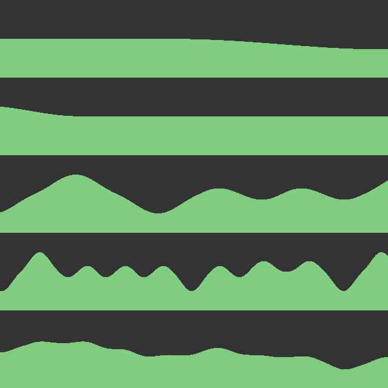
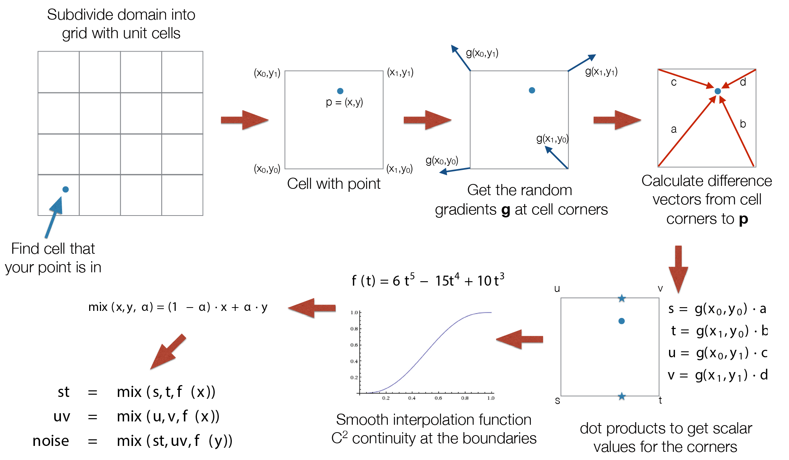
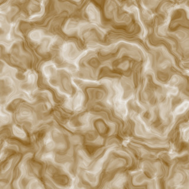
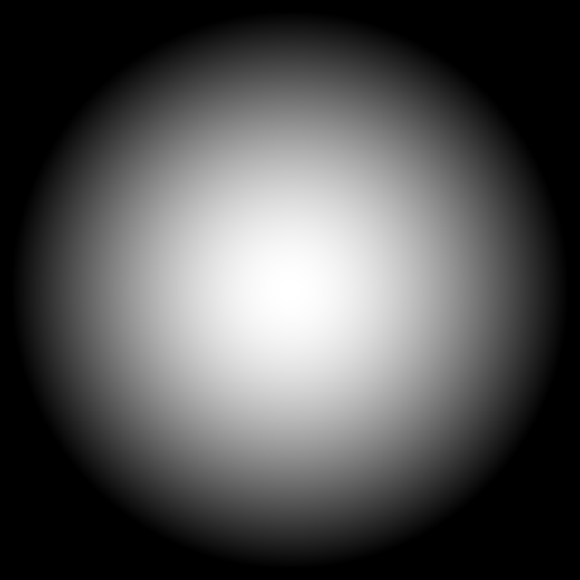
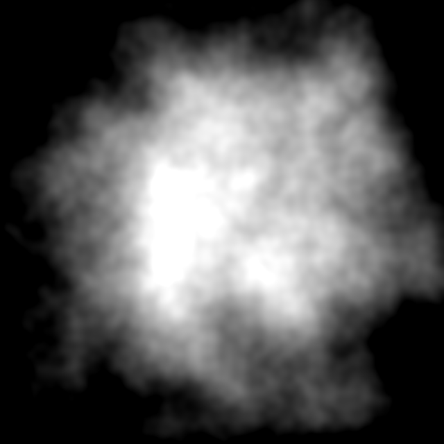
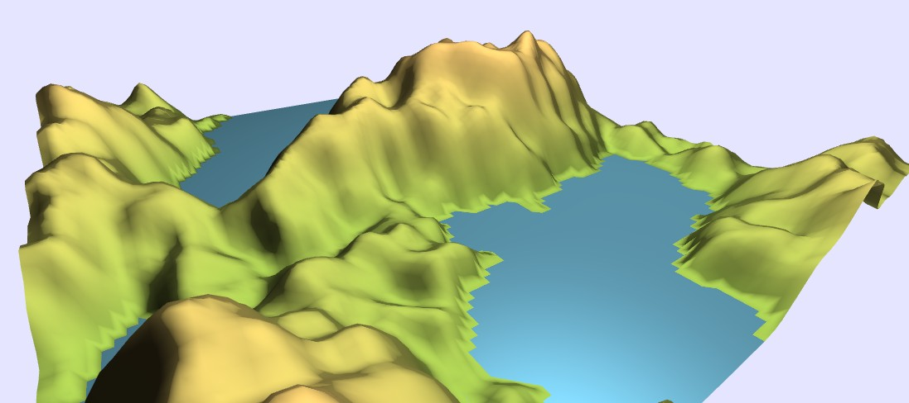
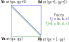

<figure class="captioned">
<video src="doc/wl_lightning_composite.mp4" type="video/mp4" loop autoplay controls ></video>
<figcaption>Particle effects using noise functions.</figcaption>
</figure>

[Procedural generation](https://en.wikipedia.org/wiki/Procedural_generation)
is a valuable tool for game development and visual effects:
instead of manually building every asset (meshes, textures, world maps, etc.), 
we specify algorithmic rules to create numerous variations of the asset.
In this assignment, we will implement Perlin Noise and use it to generate textures and 3D terrains.

## 1. Noise

Let us define $n$-dimensional noise as a function $f : \mathbb{R}^n \rightarrow \mathbb{R}$
taking a $n$-dimensional vector and returning a scalar.
For example, 2-dimensional noise can be represented as a 2D texture,
where the brightness at point $p$ of the image indicates $f(p)$ - see Figure [[Perlin 2D noise sample]](#perlin_noise_2d_sample).
This function should have the desirable properties mentioned in lecture:
no obvious repetitiveness, rotation invariance, smoothness (band-limited), computational efficiency, and
reproducibility.

<figure id="perlin_noise_2d_sample" class="captioned">
	
	<figcaption>**Perlin 2D noise sample**</figcaption>
</figure>

There are many different types of noise functions used in graphics.
Two common categories are **value noise** and **gradient noise**.
Both approaches generate pseudorandom values on a grid
(whose points are typically placed at the integer coordinate locations of $\mathbb{R}^n$) and then interpolate
them throughout $\mathbb{R}^n$. Value noise methods generate random *values* at the grid points and
interpolate them with standard polynomial interpolation, convolution, or some other technique.
Gradient noise methods instead generate random *gradients* at the
grid points and apply Hermite interpolation. Interpolating gradients instead of
values allows us to get higher degree (smoother) noise functions with more
local (efficient) calculations.

In this assignment, we will implement Perlin noise, a gradient noise technique
so popular that some use the names "Perlin noise" and "gradient noise" interchangeably.
There are many online resources on Perlin noise, 
for example [*Understanding Perlin Noise*](http://flafla2.github.io/2014/08/09/perlinnoise.html)
(the only difference in their implementation is the hash function they use).

## 2. Perlin Noise in 1D

Let us investigate the 1D case of Perlin noise step by step.
We will be completing the function `perlin_noise_1d` in file `src/shaders/noise.frag.glsl`.
Run the file `index_textures.html`.

### Steps

#### Find the surrounding cell corners

Grid points appear at integer coordinates.
In 1D, a cell is just an interval $[c_0, c_1]$.
We can find the left endpoint ("cell corner") of this interval by applying the [`floor`](https://www.khronos.org/registry/OpenGL-Refpages/gl4/html/floor.xhtml) function to $p$,
$$
	c_0 = \lfloor{p}\rfloor,
$$
and right endpoint will be $c_1 = c_0 + 1$.

An example is shown in Figure [[Perlin gradients 1D]](#fig_perlin_gradients_1d),
where $p = 1.7$ is marked with a red star.
The neighboring grid points are 1 and 2, marked with vertical gray lines.

<figure class="captioned" id="fig_perlin_gradients_1d">
	</img>
	<figcaption>**Perlin gradients 1D**  
	Dotted lines: linear functions at the cell corners that will contribute to the noise values.  
	Blue line: final interpolated result.
	</figcaption>
</figure>

#### Determine gradients $g$ at cell corners

The noise should be deterministic, meaning we get the same result every time we
run it---regardless of what computer we run it on---but still "look" random. Therefore, we need a
repeatable way to assign gradient vectors to cell corners. 
In the original Perlin noise method from 1985, a large lookup table of random gradients was pre-computed, 
and a hash function was used to map $n$D grid point indices in $\mathbb{Z}^n$ to 1D indices into this lookup table. 
In the improved version from 2002, we use a table of only 12 specially chosen gradients listed in
[Perlin's article](http://mrl.nyu.edu/~perlin/paper445.pdf). 
Perlin's justification for this simplified table is that human vision is relatively insensitive
to the granularity of orientations, so randomly choosing from 12 different
directions is enough to fool your eye into thinking the pattern is rotationally invariant.

So, with this improved approach, we use a hash function $h : \mathbb{Z}^n \rightarrow \{0, 1, \dots, 11\}$ 
to deterministically assign an integer to every grid point $c_i \in \mathbb{Z}^n$ and then use this integer to choose from the table of 12 gradients:
$$
    g_i = \mbox{gradients}(h(c_i)).
$$
Provided our hash function assigns integers to grid points in a somewhat random-looking way,
the gradient assignment will also appear random.

Due to limitations in the older versions of GLSL we need to support, we cannot
actually implement the gradient lookup table with an array; indexing arrays with
an integer variable was only introduced in GLSL ES 3. We instead provide a function `gradients(i)`
that returns the appropriate gradient.

The hash functions used for Perlin noise are based on a pseudorandom permutation
$P$ of the integers $0..N$. For example, for 2D grids, you calculate the hashed
value of an integer point $(i, j)$ by evaluating $P(i + P(j))$. 
Here, we assumed the inputs to $P$ are first reduced modulo $N$.

Most CPU-based Perlin noise implementations use a fixed permutation, stored in an array of integers. 
However, this table-based approach is not as well suited for the GPU architecture. 
For this assignment in GLSL, we use the function $P(x) = (34 x^2 + x) \mod 289$, which
surprisingly gives a random-looking permutation of the integers $0..288$, and is efficient to evaluate. 
A hash function based on this permutation is already implemented for you in `hash_func`.

#### Calculate contributions

The gradient chosen for each corner $c_i$ defines a linear function over
all of $\mathbb{R}^n$:
\begin{equation}
\label{eq:contribution}
\phi_i(p) = g_i \cdot (p - c_i).
\end{equation}
This is the unique linear function taking value $0$ and gradient $g_i$ at $c_i$.

When evaluating the noise function at $p$, we simply interpolate the values of
each corner's linear function at $p$. The linear functions for each grid point are plotted
as dotted lines in Figure [[Perlin gradients 1D]](#fig_perlin_gradients_1d).
The value at $p = 1.7$ will be an interpolation of the linear functions $\phi_1$ and $\phi_2$,
plotted as green and red lines.

#### Interpolate contributions

The final value of our noise at $p$ is a weighted average of the linear 
functions $\phi_i$ for $p$'s surrounding cell corners.
The idea is to smoothly interpolate the values of these linear functions based
on how close $p$ is to each corner. 
Let's assume $p$ lies on the interval between corners $c_i$ and $c_{i + 1}$ and is at distance $t = p - c_i \in [0, 1]$ along this interval.

We use the [`mix`](https://thebookofshaders.com/glossary/?search=mix) function,
which performs linear interpolation between values $x$ and $y$ with the weight $\alpha$:
when $\alpha = 0$ it yields $x$ and when $\alpha=1$ it yields $y$.
$$
\mbox{mix}(x, y, \alpha) = (1-\alpha) x + \alpha y.
$$
However, we do not simply want to linearly interpolate the values of the
corner's functions; this would
lead to severe discontinuities in the gradient of our noise function.
Instead, to ensure our noise function is smooth across the grid points, we
calculate the interpolation weights using the polynomial:
$$
    \alpha(t) = 6t^5 -15t^4	+10 t^3.
$$
The weights of each corner's contributions are plotted in Figure [[Perlin Interpolation 1D]](#fig_perlin_interpolation_1d).
For example, when $p$ is close to $1$, $t$ is small, and therefore the
result is dominated by the contribution $\phi_1$. So near 1, the interpolated
blue line closely follows the green dashed line. 
When $p$ is close to $c_1 = 2$, $t$ is near 1, and the red dashed line dominates the result.

<figure class="captioned" id="fig_perlin_interpolation_1d">
	</img>
	</img>
	<figcaption>
    **Perlin Interpolation 1D**: Interpolation weights for the 1D Perlin noise (top); result (blue curve)
    of blending the linear functions $\phi_i$ (dotted lines) with the interpolation weights.
	</figcaption>
</figure>

### Task 2.1: 1D noise

Implement the 1D Perlin noise in function `perlin_noise_1d`.
Press **1** to see your results and **s** to download a snapshot (similar to Figure [[Noise plots 1D]](#fig_plots_1d)).
The different plots display your noise function at different frequencies (see section below).
The last plot is fBm, which you will implement later.

<figure class="captioned" id="fig_plots_1d">
	</img>
	<figcaption>**Noise plots 1D**: Top 4 plots depict the Perlin noise function at different frequencies.
		The bottom plot shows the weighted sum of these octaves (fBm).
		The Y range of the plots is $[-1, 1]$.
	</figcaption>
</figure>

## 3. Fractional Brownian Motion

Textures in nature have both low frequency (general shape) and high frequency (detail) components.
In order to mimic this effect, we combine noise at different frequencies;
the resulting noise function is called fractional Brownian motion (fBm).
It is also explained in external tutorials [[1]](https://thebookofshaders.com/13/)
and [[2]](http://flafla2.github.io/2014/08/09/perlinnoise.html#working-with-octaves).

([Brownian motion](https://en.wikipedia.org/wiki/Brownian_motion) is the physical phenomenon where many small particles hit a heavy particle, 
with each collision contributing momentum in a different direction, resulting in random irregular motion of the big particle.)

To obtain the noise at frequency $\omega$, we multiply the input point $p$ by $\omega$, evaluating the noise value $f(p \; \omega)$.
The noise functions at the various scaled frequencies are called *octaves*, and just as with musical octaves, the frequency rises exponentially with each octave.
So for the $i$-th octave, we have $\omega_i = \omega_1^i$.

We want the contributions of the high octaves to be small details on top of dominant lower frequencies.
Therefore, we reduce the amplitude of the noise with each octave, also exponentially.
The weight for the $i$-th octave is $A_i = A_1^i$, where $A_1 \in [0, 1]$.

The final result is therefore:
$$
\mbox{fbm}(p) = \sum_{i=0}^{N - 1} A_1^i f(p \; \omega_1^i).
$$

In the code, $\omega_1$ is `freq_multiplier`, $A_1$ is `ampl_multiplier`, and $N$ is `num_octaves`.

**Turbulence** is very similar to fBm: the only difference is we sum the *absolute values* of octaves:
$$
\mbox{turbulence}(p) = \sum_{i=0}^{N - 1} A_1^i |f(p \; \omega_1^i)|.
$$

### Task 3.1: FBM 1D

Implement the 1D fractional Brownian motion in function `perlin_fbm_1d`.
Your result is displayed in the bottom plot.

## 4. Perlin Noise 2D

Now we extend the algorithm to 2D; the 2D process is also described in the procedural modeling [lecture slide 43](https://courses-gcm.epfl.ch/icg2023/07-Procedural-Modeling-deck.html#/d-perlin-noise-example-5){ target="blank" }.

There are several differences compared to the 1D case:

* Each cell has 4 corners. We can still get one of the corners
using $c_{00} = floor(p)$ and obtain the others by adding appropriate offsets to $c_{00}$.
	
* [The contribution equation](#calculate-contributions) now operates on 2D vectors, and $\cdot$ is the dot product.
	
* The interpolation now has two steps, one per dimension:
the two pairs of contributions at the top and bottom of the cell are first
interpolated along the $X$ axis ($st$ and $uv$ in the diagram), and then
this result is interpolated along the $Y$ axis.
(The $x$ and $y$ in the slide's formulas mean $p$'s *relative position inside the cell*.)

With this 2D Perlin noise function, we can use exactly the same procedure
described in [the fBm section](#fractional-brownian-motion) to implement 2D variants of fBm and
turbulence.  

<figure >
	</img>
</figure>

### Task 4.1
Implement 2D Perlin noise in the function `perlin_noise`.
Press **2** to see your results and **s** to download a snapshot image.

### Task 4.2
Implement 2D fBm in the function `perlin_fbm`.
Press **3** to see your results and **s** to download a snapshot image.

### Task 4.3
Implement 2D turbulence in the function `turbulence`.
Press **4** to see your results and **s** to download a snapshot image.

**Shader viewer:**
The code we provide includes an interactive noise viewer.
You can move around your texture by clicking and dragging with the mouse
and change the scale with the scroll-wheel.
Press **s** to download a `png` of the current texture.

## 5.  Textures

<figure class="col3" id="fig_textures">
	
	
	
	<figcaption>*(a)* Map</figcaption>
	<figcaption>*(b)* Marble</figcaption>
	<figcaption>*(c)* Wood</figcaption>
</figure>

The primitive noise functions you have implemented can be used to procedurally generate many different textures.

**World Map**
We interpret the noise value $s = \text{fbm}(p)$ as a terrain elevation.
If $s$ is below the water level, we give it the color of water.
Otherwise we interpolate (mix) between between the grass color and the mountain color
with weight $\alpha = \left(s - s_{\mbox{water}} \right)$.

**Wood**,
described in [this article](http://lodev.org/cgtutor/randomnoise.html),
is an interpolation between dark brown and light brown, with the following weight $\alpha$:
\begin{align*}
	\alpha = & \frac{1}{2}( 1 + \sin( 100 \left( ||p|| + 0.15 \; \text{turbulence}(p)\right) ) ). \\
\end{align*}

**Marble**,
described in [this article](http://www.iquilezles.org/www/articles/warp/warp.htm),
is an interpolation between white and dark brown, with the following weight:
\begin{align*}
    \alpha = & \frac{1}{2}(1 + \text{fbm}(p + 4 q)), \ \text{where} \\
q = & (\text{fbm}(p), \text{fbm}(p + (1.7, 4.6) ) ).
\end{align*}
Note, this is an example of the domain distortion/warping technique, where the
output of one noise function is used to perturb the input to another. The
result is the swirly pattern shown in image *(b)*.

### Task 5.1
Implement those textures in functions `tex_map`, `tex_wood`, `tex_marble`.
Press **5**, **6**, **7** to see your results.
As before, you can move around, zoom in/out or take screenshots.

## Noise textures usage example - particle systems 

In the exercise we practice using noise functions for textures and procedural terrain.
But they are also invaluable for smoke, cloud or fire-like effects.

Below we demonstrate a very simple cloud texture expression.
In conjunction with particle systems, it can yield visually appealing results.
That is something you might try for your project!

### Cloud texture

Start with a gaussian:

$$ d = ||(u, v) - (\frac{1}{2}, \frac{1}{2})||^2 $$

$$ g =  2 \exp( -3 d ) - 1 $$

Perturb with noise:

$$ f(u, v) = g + \frac{1}{2} fbm(u, v)  $$

<figure class="row">

</figure>

### Particle smoke

We put this texture in a particle system  and quickly achieve a smoke effect.

<figure>
<video src="doc/smoke_particle_effect_cut.mp4" type="video/mp4" loop autoplay controls ></video>
</figure>

### Complex particle systems

Here is a more complex particle system I made:
the noise functions are used both for particle textures and to drive some of their movement paths.
The demos in this document are implemented using [Unreal Engine's "Niagara" particle system](https://docs.unrealengine.com/en-us/Engine/Niagara).

<figure>
<video src="doc/wl_lightning_composite.mp4" type="video/mp4" loop autoplay controls ></video>
</figure>

## 6. Terrain

<figure class="col2" >
	
	
	<figcaption>**Procedural terrain**:  
	the elevation is equal to the value of fBm.
	(The shading might look slightly different than here)</figcaption>
	<figcaption>**Grid cell**:  
	Tiling a grid cell with triangles.</figcaption>
</figure>

In the previous section, we built a map texture of our procedurally generated world.
Now let us build the terrain in 3D, as shown in the figure above.
To that end, we will build a 3D triangle mesh, which consists of:

* **Vertices** $v_0, v_1, \ldots v_{N_v-1} \in \mathbb{R}^3$: points in 3D space.
* **Faces** $f_0, \ldots f_{N_f-1} \in \{0, 1, \dots, N_v-1\}^3$.
	Each face is a triangle spanning three of the mesh's vertices,
	specified by index.
	For example, the face $f_i = (a, b, c)$ spans between $v_a, v_b$ and $v_c$.

* **Normals**. We provide vertex normals calculated using finite difference approximations of the height map's gradient.

Please look at the function `terrain_build_mesh` in `src/terrain.js`.

In the first part, we construct the vertices on a rectangular grid in the $XY$ plane.
The **world XY** coordinates of the vertex should be such that the vertices span a uniform grid from -0.5 to 0.5
(this is an arbitrary choice, which we made to have good proportions with the height).
Please convert the integer grid coordinates $(g_x, g_y)$ into 2D points in the range $[-0.5, 0.5]^2$.

The **world Z** coordinate of each vertex is determined by the fBm value at that point.
We already wrote the code to capture your GLSL fBm output into a 2D array
called `height_map`, which you can access with the grid coordinates using `height_map.get(g_x, g_y)`.
We scale the fBm value by 0.25 to achieve a reasonable height with respect to the size of the scene.

We also want to produce flat lakes in regions where the height value falls below the `WATER_LEVEL`:

* the vertex *Z* should be clamped back to `WATER_LEVEL`
* the normal should be overriden to $[0, 0, 1]$.

Vertices must be fed into GPU memory as a 1D sequence $v_0, v_1, \ldots v_{N_v-1}$,
so we "flatten" the grid position $(g_x, g_y)$ into the 1D index $(g_x + \mbox{width}*g_y)$;
this conversion is done by the function `xy_to_v_index`.

Finally, we must connect these grid vertices with triangles to cover the plane.
To that end, in the second loop, we will fill each grid square by generating two triangles,
as shown in Figure [[Grid cell]](#fig_grid_cell).

**Notice:** To complete the rendering pipeline, please:

* Copy the `update_cam_transform` function from your previous exercise solutions to `src/main_terrain.js`.

* Complete the terrain coloring shaders `src/shaders/terrain.*.glsl`
by adapting your solution for the map texture.
Apart from setting the color (variable `material_color`), configure the `shininess` to be 30.0 for water and 2.0 for terrain.
Additionally, insert your **Blinn-Phong shader** setup from Assignment GL2 or GL3 (but without shadows).
Please use the same material color (`material_color`) for both the specular and diffuse components.
	

### Task 6.1

* Implement the mesh construction function  `terrain_build_mesh` in `src/terrain.js` to generate the `vertices` and `faces` arrays.
* Complete the terrain shaders `src/shaders/terrain.*.glsl`.

View `index_terrain.html` to see the result.

## Grading

The point values for this assignment are broken down as follows:

*  15%: 1D Perlin noise (Task 2.1)
*  35%: 2D Perlin noise (Task 4.1)
*  15%: fBm and Turbulence (Tasks 3.1, 4.2, and 4.3; 5% each)
*  15%: Textures (Task 5.1; 5% each)
*  20%: Terrain (Task 6.1; Terrain mesh construction: 15%, shading: 5%)

### What to hand in

Please submit:

* It is also ok to submit the whole `src` directory instead of picking out the individual code files.
*  `src/shaders/noise.frag.glsl` - noise and texture functions,
*  Noise images: `1D plot.png`, `Perlin.png`, `FBM.png`, `Turbulence.png`,
*  Texture images: `Map.png`, `Wood.png`, `Marble.png`,
*  `src/terrain.js` - mesh building function,
*  `src/main_terrain.js`  - copy the camera function again,
*  `src/shaders/terrain.*.glsl` - terrain coloring shader,
*  `readme.txt` containing the percentage of work each team member contributed and any other remarks you have (e.g., challenges you encountered).  
Name1 Surname1 (000001): 1/3  
Name2 Surname2 (000002): 1/3  
Name3 Surname3 (000003): 1/3  
We ask you to only report global contributions, there is no need to provide additional details for each sub-task. The three contributions should add up to 1.
* Please put your submission in a `.zip` archive, no `.rar` please.
 
## Bonus riddle 

(not graded)

We have used the fBm function to create the following texture.
Try guessing the formula to achieve a similar result.

<figure class="captioned">
</img>
</figure>
