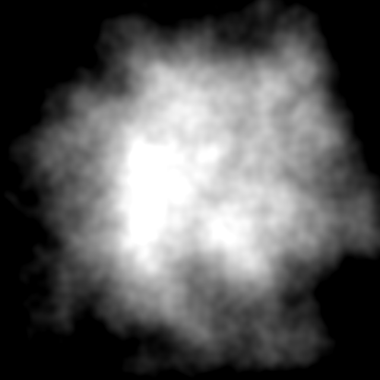

---
title: Noise for Particles
author: Krzysztof Lis
...

In the exercise we practice using noise functions for textures and procedural terrain.
But they are also invaluable for smoke, cloud or fire-like effects.

Below we demonstrate a very simple cloud texture expression.
In conjunction with particle systems, it can yield visually appealing results.

## Cloud texture

Start with a gaussian:

$$ d = ||(u, v) - (\frac{1}{2}, \frac{1}{2})||^2 $$

$$ g =  2 \exp( -3 d ) - 1 $$

Perturb with noise:

$$ f(u, v) = g + \frac{1}{2} fbm(u, v)  $$

<figure class="row">

</figure>

## Particle smoke

We put this texture in a particle system  and quickly achieve a smoke effect.

<video src="smoke_particle_effect.mp4" type="video/mp4" loop autoplay controls ></video>

## Complex particle systems

Here is a more complex particle system I made:
the noise functions are used both for particle textures and to drive some of their movement paths.
The demos in this document are implemented using [Unreal Engine's "Niagara" particle system](https://docs.unrealengine.com/en-us/Engine/Niagara).

<video src="wl_lightning_composite.mp4" type="video/mp4" loop autoplay controls ></video>

