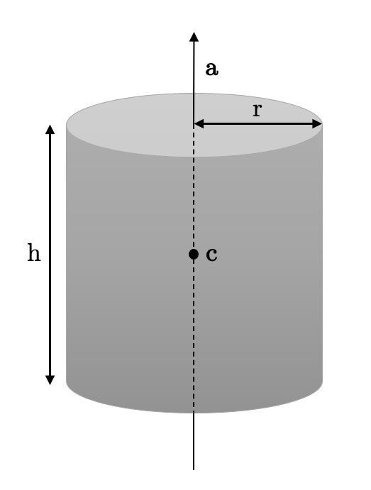

<figure id="exp-primitives"></img></figure>

In this assignment, you will implement ray intersections with planes and cylinders and compute surface normals at the intersection points. The framework code provided this week is identical to last week's, except we added methods for ray/planes and ray/cylinder intersections in `src/tracer.frag.glsl`.

The above picture shows what we expect you to produce after successfully completing all the tasks. The framework is configured to visualize the surface normals in false color (the normal XYZ components in [-1, 1] are mapped linearly to RGB values in [0, 1]).

Regarding the orientation (sign) of surface normals: the raytracer expects your implementation to always return a normal pointing **towards** the viewer! So for "non-closed" objects like the plane and open cylinder, where the ray may hit the surface from either side, you must choose the sign appropriately based on the ray direction. Specifically, the normal and view ray should always point in opposite directions. You can check if you got this right for the cylinder by comparing to [the figure above](#exp-primitives).

## Tasks

The following tasks consist in computing intersections and normals between a ray and a plane then between a ray aand a cylinder.

### Ray-Plane Intersection

First, you are asked to implement the intersection of a ray with a plane defined by its normal $\mathbf{n}_p$ (normalized) and offset along its normal $b$. Points $\mathbf{x}$ on this plane therefore verify $\mathbf{x} \cdot \mathbf{n}_p = b$.

#### Task RT1.1: Implement Ray-Plane intersections

* Fill in the method `ray_plane_intersection` in `tracer.frag.glsl`.
	* Compute the ray's intersection of the plane
	* If ray and plane are parallel there is no intersection
	* Otherwise compute intersection data and store it in `normal`, and `t` (distance along ray until intersection).
	* Return whether there is an intersection in front of the viewer (`t > 0`)
* The plane is two sided, so the normal you return depends on the side from which we view it. Test this by negating (setting to minus the same vector) a plane normal in `scenes.js`. The normals visible in the image should not change.
* Save the generated images in *Normals* mode from scenes `corner1` and `corner2`. Press `S` to save the image.

*Hint*: to test the intersection expression you implemented, we provide you with a numerical example of what you should obtain with the following parameters ($\mathbf{n}_p$ is the plane normal, $b$ is the plane offset):

* $\mathbf{o}$ = [0.05, 0.0, 0.0], $\mathbf{d}$ = `normalize`([0.1, 0.1, 1.0])
* $\mathbf{n}_p$ = `normalize`([1.0, 1.0, 1.0]), $b$ = 0.5

You should obtain the following ray parameter $t$, intersection point $\mathbf{i}$, and normal $\mathbf{n}$:

* $t$ = 0.6868, $\mathbf{i}$ = [0.1180, 0.06800, 0.6800], $\mathbf{n}$ = [-0.5773, -0.5773, -0.5773] 

### Ray-Cylinder Intersection

You are asked to derive an expression for, then implement the intersection with an *open* cylinder i.e., without end caps. 

<figure id="fig-cylinders"></img></figure>

#### Task RT1.2.1: Derive the expression for a Ray-Cylinder intersection

* In a separate `TheoryExercise.pdf` file, derive the intersection between a ray and a cylinder
* Please use the following notation: the ray has origin $\mathbf{o}$ and direction $\mathbf{d}$. The cylinder has center $\mathbf{c}$, radius $r$, axis $\mathbf{a}$ (normalized) and height $h$ (see [diagram](#fig-cylinders)).

The approach we recommend for implementing the intersection is to first determine where the ray intersects a version of the cylinder that extends infinitely in each direction (as if $h\rightarrow +\infty$). Then, from this list of intersection candidates, discard those that fall outside the cylinder's actual extent. Finally, choose the first remaining intersection that appears in front of the viewer.

#### Task RT1.2.2: Implement Ray-Cylinder intersections

* Fill in the method `ray_cylinder_intersection` in `tracer.frag.glsl`.
	* Compute the ray's first valid intersection with the cylinder (valid means in front of the viewer: `t > 0`)
	* Store intersection point in `intersection_point`
	* Store ray parameter in `t`
	* Store normal at intersection_point in `normal`.
	* Return whether there is an intersection with `t > 0`
* Save the generated images in *Normals* mode from scenes `cylinders` and `barrel` and `creature`. Press `S` to save the image.

*Hint*: to test the intersection expression you implemented, we provide you with a numerical example of what you should obtain with the following parameters:

* $\mathbf{o}$ = [0.05, 0.0, 0.0], $\mathbf{d}$ = `normalize`([0.5, 0.3, 1.0])
* $\mathbf{c}$ = [0.0, 0.0, 0.1], $\mathbf{a}$ = [0.0, 0.0, 1.0], $r$ = 0.1, $h$ = 0.5

You should obtain the following ray parameter $t$, intersection point $\mathbf{i}$, and normal $\mathbf{n}$:

* $t$ = 0.1067, $\mathbf{i}$ = [0.09610, 0.02766, 0.09220], $\mathbf{n}$ = [-0.9610, -0.2766, 0.0] 

## Grading

Each task of this assignment are graded as follow:

* Ray-plane intersection: 20%
* Ray-cylinder intersection + normal derivations (theory exercise): 25%
* Ray-cylinder intersection implementation: 40%
* Cylinder normal implementation: 15%

## Custom scenes

Composing a scene out of planes, spheres and cylinders can be a creative puzzle.
We invite you to try making your own scenes and share them.
This part is not graded, but if you submit your custom scenes we will showcase them in the course gallery.

You can create your own scene using the blender file `RT_scenes.blend`.
First, modify your scene:

* Copy and paste the primitives (`cylinder_edit`, `sphere_edit`, `plane_edit`) to make more of them
* Move (G), rotate (R) and scale (S) them to arrange your scene
* You can also move the camera object in the scene. View current camera placement with *[Numpad 0]*. You can set the camera object's pose to current viewport with *Align Active Camera to View [Ctrl Alt Numpad 0]*.

<figure></img></figure>

* When the scene is ready, switch to the scripting view and run the script:

<figure></img></figure>

* The file `export_scene_custom.js` should have been written. Copy the scene description from there into `src/scenes.js`. Your scene should now be available for rendering.

If you want to show you special scene only to us but not other students, please indicate that in the readme.
You can think about an interesting name for your scene too!

## What to hand in

A .zip compressed file renamed to `ExerciseN-GroupI.zip`, where *N* is the number of the current exercise sheet, and *I* is the number of your group.
It should contain only:

* The files you changed (in this case, `tracer.frag.glsl`) and the requested program output: `creature_normals.png`, `corner1_normals.png`, `corner2_normals.png`, `cylinders_normals.png`, `barrel_normals.png`. It is up to you to make sure that all files that you have changed are in the zip.
* A `readme.txt` file containing a description on how you solved each exercise (use the same numbers and titles)
and the encountered problems. Indicate what fraction of the total workload each project member contributed.
* Other files that are required by your `readme.txt` file. For example, if you mention some screenshot images in `readme.txt`, these images need to be submitted too.
* A `TheoryExercise.pdf` containing your cylinder-ray intersection and normal derivations.
* Generated images from any custom scenes you would like to share.
