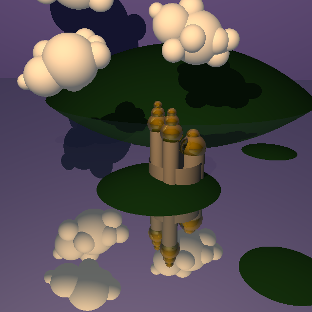
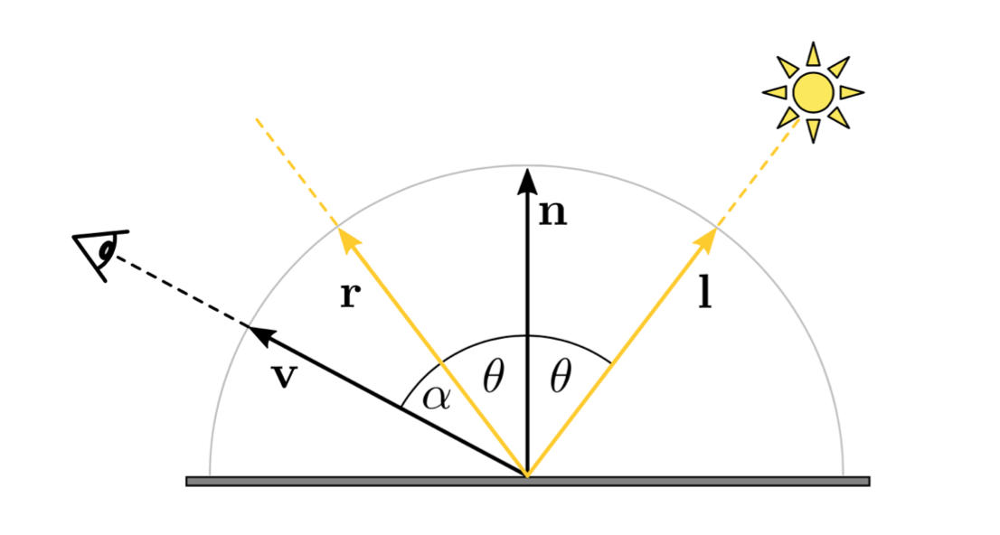
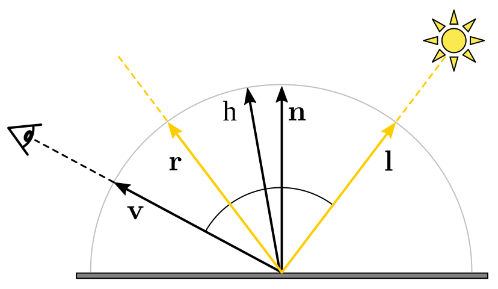
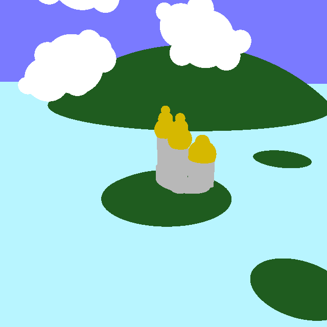
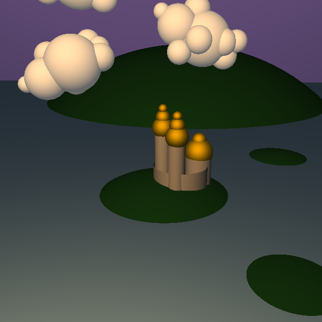
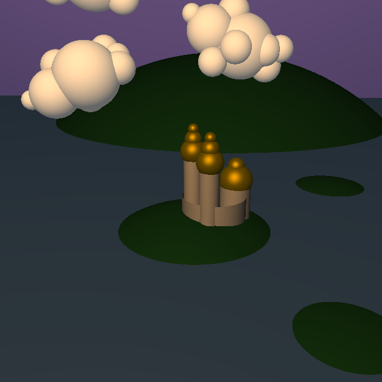
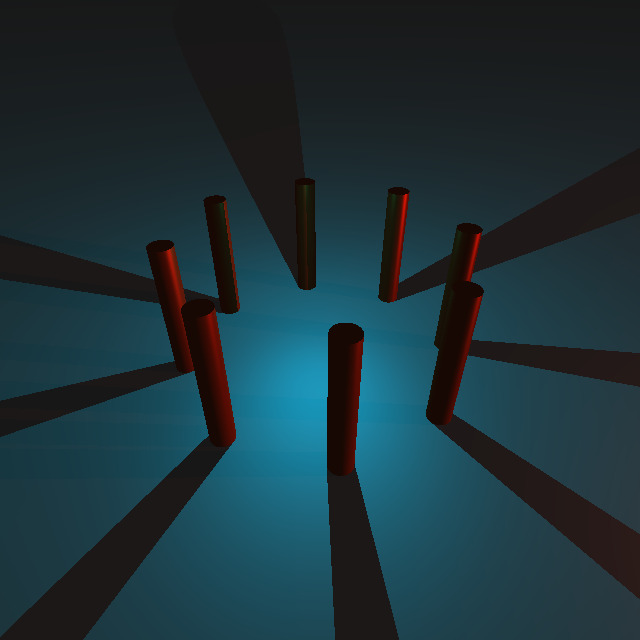
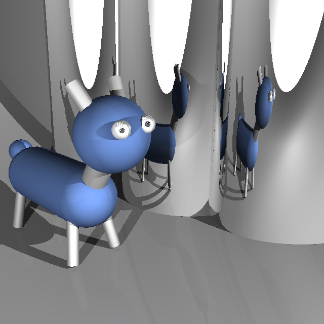
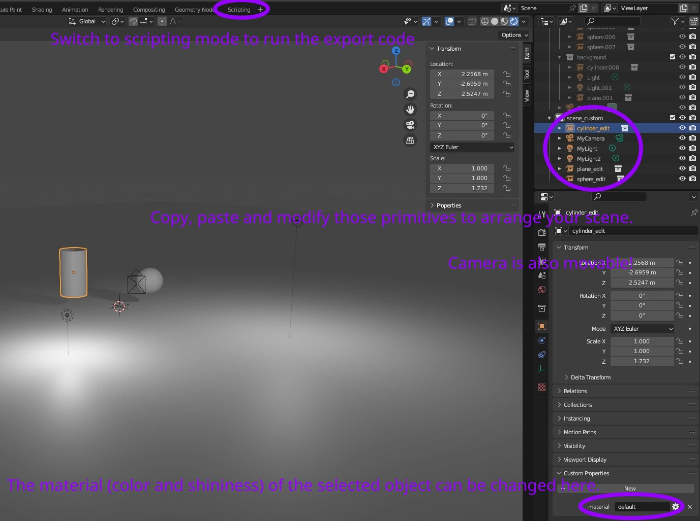
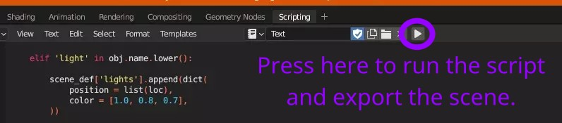

<figure id="castle-full"></img></figure>

In this assignment, you will implement the Phong lighting model and add reflections to your scenes. The framework code for this assignment extends the one from last week; if you download a fresh copy from Moodle, you will need to copy your implementations of the plane and cylinder intersections into the files `tracer.frag.glsl`. 

You can check that your implementation is correct by comparing to various scenes we rendered for you. One such result is shown in the [figure above](#castle-full).

## Tasks

The following tasks consist implementing the Phong and Blinn-Phong lighting models, then having shadows and reflexions working in your scene.

### Lighting Models

#### Phong

<figure id="fig-phong" class="captioned"></img>
<figcaption>Reflected direction $\mathbf{r}$ in Phong lighting model.</figcaption></figure>

The goal of the first part of this assignment is to implement the Phong lighting model. So far, we colored objects in the scene according to their normals. Phong model enables having more realistic scenes at a relatively low cost. We recall the corresponding empirical formula (that can also be found in the slides):

$$\mathbf{I} = \mathbf{I}_a*\mathbf{m}_a + \mathbf{I}_l*(\mathbf{m}_d.(\mathbf{n}^T\mathbf{l}) + \mathbf{m}_s.(\mathbf{r}^T\mathbf{v})^s)$$

The notation used for the vectors is given by the above [diagram](#fig-phong). The component-wise multiplication is denoted by $*$ in the above. We also denote by $\mathbf{I}$ the global intensity at an intersection point (containing the 3 RGB components), $\mathbf{I}_a$ the ambient intensity, and $\mathbf{I}_l$ the light intensity. Lastly, the material characteristics are given by: $\mathbf{m}_a$ the RGB ambient coefficients, $\mathbf{m}_d$ the RGB diffuse coefficients, $\mathbf{m}_s$ the RGB specular coefficients, and $s$ the shininess. Such coefficients can be recovered in the code by multiplying `materials.color` (a 3D vector) and `materials.*` (a float), where `*` needs to be replaced by the relevant coefficient name. The above formula is valid under certain conditions, which can be found in the lecture slides.

#### Blinn-Phong

<figure id="fig-BlinnPhong" class="captioned"></img>
<figcaption>Half vector $\mathbf{h}$ in Blinn-Phong lighting model.</figcaption></figure>

$$\mathbf{I}_{BP} = \mathbf{I}_a*\mathbf{m}_a + \mathbf{I}_l*(\mathbf{m}_d.(\mathbf{n}^T\mathbf{l}) + \mathbf{m}_s.(\mathbf{h}^T\mathbf{n})^s)$$

The Blinn-Phong lighting model is a historical evolution and simplification over the aforementioned Phong model.
The specular component is determined by the product of surface normal $\mathbf{n}$ and the half-vector $\mathbf{h}$, raised to the power of shininess $s$. The half vector is the intermediate direction between viewing direction $\mathbf{v}$ and direction to light $\mathbf{l}$:

$$h = \frac{\mathbf{v}+\mathbf{l}}{||\mathbf{v}+\mathbf{l}||}$$

#### Examples

A good first step is to implement the diffuse component, which is the same for both models.
Going from flat colors to diffuse lighting allows us to clearly see the shapes of objects. 

<figure class="col2">
	</img>
	</img>
	<figcaption>Flat colors of the *castle* scene.</figcaption>
	<figcaption>Diffuse lighting allows us to clearly see the shapes of objects.</figcaption>
</figure>

The specular component of Phong and Blinn-Phong gives us shiny surfaces.
You may notice that the specular highlights are bigger in the Blinn-Phong version. To achieve a similar result, we would increase the shininess $s$.

<figure class="col2">
	</img>
	</img>
	<figcaption>Blinn-Phong shading.</figcaption>
	<figcaption>Phong shading.</figcaption>
</figure>

#### Task RT2.1: Implement Lighting Models

* Implement the diffuse component `lighting` in `tracer.frag.glsl`:
	* Compute the diffuse component and make sure that the light is located on the correct side of the object.
* Fill in the method `render_light` in `tracer.frag.glsl`.
	* Check whether the ray intersects an object in the scene.
	* If it does, compute the ambient contribution to the total intensity.
	* Then compute the intensity contribution from each light in the scene and add them.
* Compute the specular light components in `lighting` in `tracer.frag.glsl` according to Blinn-Phong and Phong models:
	* Implement the Blinn-Phong shading model. Compute the half vector and resulting specular component.
	* Implement the Phong shading model. Make sure that the reflected light shines towards the camera and compute the resulting specular component.

* Select the scenes `shading_lights`, `shading_speculars` and save the image (press S). Please do so for both Phong and Blinn-Phong shading mode.
	* Note that in `shading_lights`, two distinct red and green lights should be visible.

*Hint*: You can use existing methods for `vec3` objects such as `mirror`, `reflect`, `norm`, `dot`, and `normalize`.

### Shadows

<figure id="columns_shadows" class="captioned"></img>
<figcaption>Example of shadows in the columns scene</figcaption></figure>

Next, some objects in the scene might occlude light sources, which we want to account for.

#### Task RT2.2: Implement shadows

* Fill in the method `lighting` in `tracer.frag.glsl`.
	* Shoot a shadow ray from the intersection point to the light.
	* Check whether it intersects an object from the scene.
	* Update the lighting accordingly.
* Select the scene `desk` and save an image.

*Hint*: Don't forget to rule shadow acne out as described in lecture.

### Reflections

<figure id="mirror_creature" class="captioned"></img>
<figcaption>Example of reflections in the mirror_creature scene</figcaption></figure>

The last part of this assignment is about adding reflections to your scene. During lectures, you saw that raytracing was based on recursive strategy, which isn't allowed with WebGL. Instead, we will opt for a iterative approach that involves a `for` loop. The maximum number of reflections is defined in `tracer.frag.glsl` by `NUM_REFLECTIONS`, and denoted by $N$ in this handout. The resulting color for a given pixel $\mathbf{c}_b$, is obtained from the color at the first intersection without reflections $\mathbf{c}_0$, and the color $\mathbf{c}^1$ due to further reflections using the following relation:

$$\mathbf{c}_b = (1 - \alpha_0) \mathbf{c}_0 + \alpha_0 \mathbf{c}^1$$

Where $\alpha_0\in[0, 1]$ gives how much reflective the material we intersect first is, and can be accessed with `materials.mirror` in the code. Also, the color $\mathbf{c}^1$ can be computed by recursively following the reflected ray. Denoting by $\mathbf{c}^2$ the color obtained by blending colors after 2 reflections, we have:

$$\mathbf{c}^1 = (1 - \alpha_1) \mathbf{c}_1 + \alpha_1 \mathbf{c}^2$$

Again, $\mathbf{c}_1$ corresponds to the color obtained at the intersection of the first reflected ray without considering reflections, and $\alpha_1$ is the reflection coefficient of the material that is being intersected with the first reflected ray. To simplify notations, we consider that if intersection number $i$ doesn't occur, the corresponding color obtained without reflection at this intersection $\mathbf{c}_i=0$. You will first see how this can be unraveled into an iterative procedure, which you will then able to implement.

#### Task RT2.3.1: Derive iterative formula

* In a separate `TheoryExercise.pdf` file, show that we have the following:

$$\mathbf{c}_b =  \sum_{i=0}^{+\infty} (1 - \alpha_i) \left(\prod_{k=0}^{i-1} \alpha_k \right) \mathbf{c}_i$$

* Give a simplification of the above formula, noting that we consider at most $N$ reflections.
* Briefly explain why and how you can compute the obtained expression with the current `lighting` function you implemented.

Now that you know how to change the recursive strategy into an iterative one, it remains to implement it into your raytracer.

#### Task RT2.3.2: Implement reflections

* Fill in the method `render_light` in `tracer.frag.glsl`.
	* Create an outer loop on the number of reflections.
	* Compute lighting with the current ray (might be reflected).
	* Use the above formula for blending the current pixel color with the reflected one.
	* Update ray origin and direction.
* Switch the number of reflections in the UI.
* Select the scenes `mirror1`, `mirror2` and make screenshots. Choose the number of reflection you prefer and note it in the report.

*Hint*: Don't forget offset intersection points to avoid reflection artifacts the same way as you did for shadow acne in the previous task.

## Custom scenes

Composing a scene out of planes, spheres and cylinders can be a creative puzzle.
We invite you to try making your own scenes and share them.
This part is not graded, but if you submit your custom scenes we will showcase them in the course gallery.

You can create your own scene using the blender file `RT_scenes.blend`.
First, modify your scene:

* Press the eye icon next to the scenes to show or hide them. You can see some of the assignment scenes here.
* Copy and paste the primitives (`cylinder_edit`, `sphere_edit`, `plane_edit`) to make more of them
* Move (G), rotate (R) and scale (S) them to arrange your scene
* You can also move the camera object in the scene. View current camera placement with *[Numpad 0]*. You can set the camera object's pose to current viewport with *Align Active Camera to View [Ctrl Alt Numpad 0]*.
* Move or copy lights
* Assign material names to objects (bottom right)

<figure></img></figure>

* When the scene is ready, switch to the scripting view
* Edit the material definitions to match the material names you used
* Run the script to export the scene

<figure></img></figure>

* The file `export_scene_custom.js` should have been written. Copy the scene description from there into `src/scenes.js`. Your scene should now be available for rendering.

If you want to show you special scene only to us but not other students, please indicate that in the readme.
You can think about an interesting name for your scene too!

## Grading

Each task of this assignment are graded as follow:

* Ambient contribution: 5%
* Diffuse contribution: 15%
* Specular Phong contribution: 10%
* Specular Blinn-Phong contribution: 10%
* Sum of light sources 5%
* Shadows: 25%
* Reflections (theory part): 10%
* Reflections (implementation part): 20%

## What to hand in

A .zip compressed file renamed to `ExerciseN-GroupI.zip`, where *N* is the number of the current exercise sheet, and *I* is the number of your group.
It should contain only:

* The files you changed (in this case, `tracer.frag.glsl`) and the requested program output: `shading_lights_Phong.png`, `shading_lights_BlinnPhong.png`, `shading_speculars_Phong.png`, `shading_speculars_BlinnPhong.png`, `desk_Phong.png`, `mirror1_Phong.png`, `mirror2_Phong.png`. It is up to you to make sure that all files that you have changed are in the zip. For the shadow and mirror part you can choose 
* A `readme.txt` file containing a description on how you solved each exercise (use the same numbers and titles)
and the encountered problems. Indicate what fraction of the total workload each project member contributed.
* Other files that are required by your `readme.txt` file. For example, if you mention some screenshot images in `readme.txt`, these images need to be submitted too.
* A `TheoryExercise.pdf` containing your derivation for the iterative reflections formula.
* Generated images from any custom scenes you would like to share.

Submit solutions to Moodle before the deadline. Late submissions receive 0 points!

