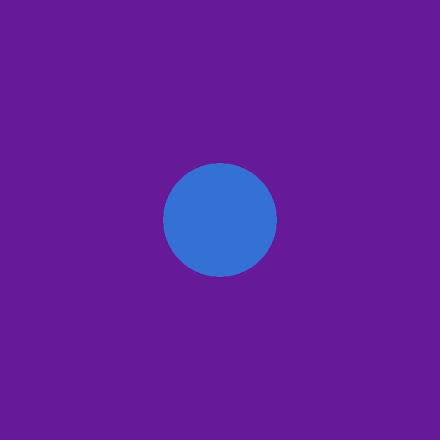
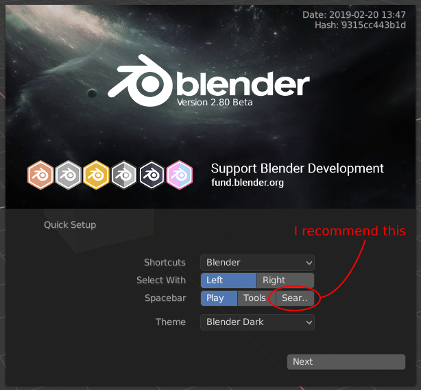
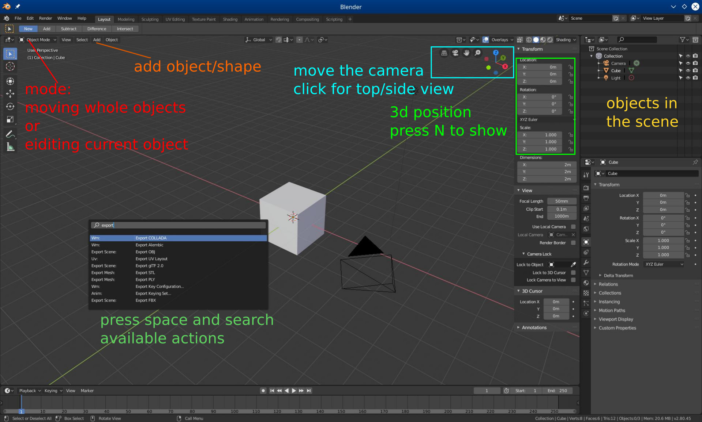

<figure></img></figure>

This ungraded assignment is primarily intended to ensure the provided raytracing framework code properly runs on your computer. Instructions for running the code are provided later in this handout. You are also encouraged to browse through and familiarize yourself with the code; future assignments will ask you to add various functionalities to it.

We recommend creating a **private** GitHub or GitLab repository for collaboration with your fellow group members. For those new to Git, a basic tutorial can be found [here](http://try.github.io). But feel free to use other code version control/synchronization tools if you prefer.

The required part of this assignment is to edit some parts of the web-application as described later in this handout, and render it to the output file "`basic-sphere.png`".


## Web technologies

The exercises involving the GPU pipeline will be implemented as web-applications run in a browser.
The GPU API available in the browser is called [WebGL](https://developer.mozilla.org/en-US/docs/Web/API/WebGL_API).
Since WebGL is not convenient to use directly, we take advantage of the [regl.js](https://github.com/regl-project/regl) library which allows us to configure the GPU pipeline in a declarative way.

In previous years, the exercises were implementing using C++ and OpenGL, but we have made the change due to the following reasons:

* Nothing to install
* No compilation step, refresh page to run again
* Convenient API of [regl.js](https://github.com/regl-project/regl/blob/gh-pages/API.md)
* Projects can be easily shared on the web
* C++/OpenGL errors are hard to resolve

We believe the raw OpenGL API is too low-level and stateful, making the core concept of the GPU pipeline hard to see.
We hope this will help you learn and empower you to create even more amazing projects.


### Application structure

The main parts of a web-application are:

* an HTML document, the content of the website
* JavaScript code run in the browser, makes the application interactive.

In our exercises, the HTML is very simple and only contains the WebGL viewport (`<canvas>`) and some overlays where we can display text.
The document references the JavaScript files which are executed by the application `<script src="src/main.js">`.

Here are the files you will find in this exercise:

* `index.html` - The file we open in browser. Specifies the layout of the application and links to the JavaScript code to load such as `<script src="src/main.js">`.
* `src` - Code you will be editing and the code we provide.
  * `main.js` - Rendering code.
  * `icg_web.js` - Provided code: interfacing with web APIs, such as keyboard input.
  * `icg_screenshot.js` - Provided code: facilitates screenshooting.
  * `raytracer_pipeline.js` - Provided code: contains scene definition and groups relevant shaders together.
  * `tracer.frag.glsl` - Code to edit: the ray-tracing implementation
* `lib` - external libraries
  * [regl.js](https://github.com/regl-project/regl) - GPU API
  * [gl-matrix](http://glmatrix.net/docs/) - vector and matrix operations.
* `resources`
  * `style.css` - specifies the appearance of the application [what is CSS](https://developer.mozilla.org/en-US/docs/Web/CSS).


### Workflow

We only need a code editor and a browser (we test the exercises for Firefox and Chromium).

* Start the local web server (described below) or open index.html directly with the browser
  * [Caddy](#caddy-web-server) server
  * [python](#python-local-web-server) server
  * [VSCode extension](#vscode-extension) server
  * [Browser settings to open HTML files directly](#browser-settings-to-open-html-files-directly)
* Open <http://localhost:8000/> in a browser
* Open the browser console to see any errors
* Edit the code files on disk (such as `tracer.frag.glsl`) and save them
* Refresh the browser tab  
	If your changes are not visible, it may be the browser cache keeping an old version of your files. In the *network tab* of developer tools, select *Disable Cache*.


#### Caddy web-server

We open `index.html` using a local web-server. Here is one way to do it:

* Download the caddy web-server for your OS: [caddy server downloads](https://github.com/caddyserver/caddy/releases)

* Put the server executable and exercise repo in a directory:
	* `some_dir/`
		* `caddy` - caddy server executable, extract it from the downloaded package
		* `icg_exercise_IN0/`
			* `index.html`
			* `src`
			* ...

* Start the server  
	`./caddy file-server -browse -listen 0.0.0.0:8080 -root icg_exercise_IN0`  
	We launch the file-server at port `8080` to serve directory `icg_exercise_IN0`.

* Open <http://localhost:8080> with a browser.

If the browser shows an error about `MIME type` on Windows,
it may be because of the [following problem with certain registry keys](https://github.com/zekroTJA/go-win-mime-fix).

You can [fix the registry keys](https://github.com/golang/go/issues/32350#issuecomment-635859542),
or run a [program to do it](https://github.com/zekroTJA/go-win-mime-fix/releases), 
or force the MIME type with the following [Caddyfile](https://caddyserver.com/docs/quick-starts/caddyfile) (configuration file for Caddy server, used together with `caddy run`):
```
:8080
root * icg_exercise0
file_server browse

@match_js {
	path *.js
}
header @match_js Content-Type text/javascript
```


#### Python local web-server

If you have `python` installed, an alternative to caddy web-server is to use a python web-server to host the site at <http://localhost:8000>.
Run the following command in terminal:

```
cd icg_IN0_setup
python3 -m http.server
```

The server post will be displayed:

```
Serving HTTP on 0.0.0.0 port 8000 (http://0.0.0.0:8000/) ...
```

Open <http://localhost:8000/index.html> in your browser.


#### VSCode extension

If you use the VSCode editor, there is an extension [vscode-preview-server](https://marketplace.visualstudio.com/items?itemName=yuichinukiyama.vscode-preview-server) which can run a local server.
An additional benefit is this will automatically refresh the page upon changes in the editor.

* install the [vscode-preview-server](https://marketplace.visualstudio.com/items?itemName=yuichinukiyama.vscode-preview-server) extension
* select `index.html`
* run the command `vscode-preview-server: Launch on browser` in VSCode. Press Ctrl+Shift+P then search for this command, or use the keyboard shortcut Ctrl+Shift+L.


#### Browser settings to open HTML files directly

If you can not run the web server as described above, you can modify browser settings to allow loading resources from disk.
Then you can open the `index.html` file directly with `Ctrl+O`.

In **Chrome** you can allow loading data from `file://` using the `--allow-file-access-from-files` switch.

* Linux
   
  	```
	chromium-browser --allow-file-access-from-files index.html
	```
* Windows  

	```
	"C:\Program Files (x86)\Google\Chrome\Application\chrome.exe" --allow-file-access-from-files index.html
	```
	If your `chrome.exe` is not found at this location, you can find it with

	```
	reg query "HKEY_LOCAL_MACHINE\SOFTWARE\Microsoft\Windows\CurrentVersion\App Paths\chrome.exe"
	```

In **Firefox** you can open `about:config` and set `security.fileuri.strict_origin_policy` to `false`.
Use a temporary profile or reset the setting later to avoid degrading the browser security.


### JavaScript development, Console and debugger

Our code runs in the browser, and therefore we use the JavaScript language.
The syntax is somewhat similar to C++, but JS is dynamically typed and does not have a compilation step.
About JavaScript on this course:

* The exercises do not involve advanced JS programming - we will mostly work on the GPU and the JS part only prepares the matrices and meshes for it.
* If you are new to JS, it is worth practicing with a tutorial, for example [JavaScript on MDN](https://developer.mozilla.org/en-US/docs/Web/JavaScript). Web development is very popular now and you are bound to run into it sooner or later.
* We try to explain as much as we can in the exercise code comments. Reading the whole file, beyond the parts you fill in, should make everything more understandable.

  
We only need a code editor and a browser (we test the exercises for Firefox and Chromium).
Let us start by *opening index.html in your browser*.

The browser's **developer tools** are a critical resource for web development:
[dev tools in FireFox](https://developer.mozilla.org/en-US/docs/Tools), [dev tools in Chrome](https://developers.google.com/web/tools/chrome-devtools).

The *Console* ([Firefox](https://developer.mozilla.org/en-US/docs/Tools/Web_Console), [Chrome](https://developers.google.com/web/tools/chrome-devtools/console)) is where any errors or logs are written.
Whenever your are running the application, you should have it open.
In JS, you can log messages and objects to the console with [console.log(x)](https://developer.mozilla.org/en-US/docs/Web/API/Console/log).

In the *Debugger* ([Firefox](https://developer.mozilla.org/en-US/docs/Tools/Debugger), [Chrome](https://developers.google.com/web/tools/chrome-devtools/javascript)), you can set breakpoints (place where the program pauses) and inspect the variables' values.

If you are new to these tools, we recommend you look at the tutorials - we can not hope to explain better than them.
With the web playing a big part in the modern world, we believe the underlying technologies are worth knowing, even if they are not directly relevant to this graphics course.


#### Possible surprises of JavaScript:

* **semicolons** in JS are put in the same places as in C++, but are optional - [the parser will usually understand the code without them](https://developer.mozilla.org/en-US/docs/Web/JavaScript/Reference/Lexical_grammar#Automatic_semicolon_insertion). In rare cases having no semicolon at the end of line, or having extra newlines, can [cause unexpected errors](https://flaviocopes.com/javascript-automatic-semicolon-insertion/).

* **functions**. `(x ) => { ... }` is a function defined using the [arrow syntax](https://developer.mozilla.org/en-US/docs/Web/JavaScript/Reference/Functions/Arrow_functions). Functions are first-class objects in JS and they are often stored in variables of passed as arguments.
A function created inside another function has access to the parent's variables - this is called a [closure](https://developer.mozilla.org/en-US/docs/Web/JavaScript/Closures). We use this in our framework often, for example to edit `mouse_offset` in the mouse-move handler function.

* **variables** are dynamically typed - they can take objects of any type. `let x = [0, 0, 0];` declares a [rebindable variable](https://developer.mozilla.org/en-US/docs/Web/JavaScript/Reference/Statements/let) and `const y = [0, 0, 0];` declares a [non-rebindable variable](https://developer.mozilla.org/en-US/docs/Web/JavaScript/Reference/Statements/const).
That is, we can do `x = 1;` but can not do `y = 1;`.
However, unlike C++, the object in `const` variable can be modified - we can do `y[0] = 1`;
There is also `var` which is now obsolete, it works like `let` but ignores scope.


<div class="box practice">
#### Practice: Console and debugger

* Create a local web server
* Open `index.html` in your browser
* Open the Console, try some basic variables and operations. Press Enter after each line, for example:
```js
let x = 1;
let y = x+5;
x
y
`${x} + 5 = ${y}`
```
* Put a break-point in the screenshot function (see comment), press S to run the screenshot, inspect what fields are stored on the `rt` object.

</div>


### Shaders

*Shaders* are programs which run on the GPU.
They have their own language, GLSL, which is quite similar to C, with the added [vector and matrix types](http://www.shaderific.com/glsl-types).
GPUs are capable of executing shaders in a massively parallel way, they can recalculate the color of each pixel in real time.  
[GLSL reference](http://www.shaderific.com/glsl/)  
[WebGL reference card](https://www.khronos.org/files/webgl/webgl-reference-card-1_0.pdf) page 3-4  
[GLSL built-in functions](https://www.khronos.org/registry/OpenGL-Refpages/es3/)

We will talk about the GPU pipeline and associated shaders later.
For now we only need to know that the code in `tracer.frag.glsl` is run for each pixel of the output image.

It writes the output pixel color to `gl_FragColor` as `vec4(Red, Green, Blue, Opacity)`.


<div class="box practice">
#### Practice: Shader compilation (1/2)

* Edit `tracer.frag.glsl`
* At the end of the main function, 
```C
vec3 my_color = 2*vec3(0.5, 0, 0);
gl_FragColor = vec4(my_color, 1.);
```
* Observe the error in the browser console
* Change `2` to `2.` to fix the error
* Remove these added lines.
</div>

#### Shader error dictionary

Here are some common shader compilation errors and their typical meaning:

* *invalid syntax* - most probably a `;` should be added to the previous line
* *cannot convert from 'const int' to* - GLSL by default does not convert integers (`2`) to floats (`2.`), add the `.` if needed
* *no matching overloaded function found* - the arguments given to a function are of wrong types (float instead of vector, int instead of float)
* *index expression must be constant* - you can only use loop indices or constants to index into arrays

<div class="box practice">
#### Practice: Shader compilation (2/2)

* Edit `tracer.frag.glsl`
* In the `get_mat2` function, comment out the loop and insert,
```C
Material m = materials[mat_id];
return m;
```
* Observe the error in the browser console
* Undo commenting out and insertion
</div>


## Example exercise

This exercise in not graded, so that we can practice working on exercises and submitting them without stress.

Please solve the two tasks given below, and upload your group's solution to moodle according to the procedure shown in the last section.

<div class="box task">

#### Task IN0.1: Set your background color

* Edit the `main` function in `src/tracer.frag.glsl`, the edit location is marked with `#TODO`.
* Choose a background color - that is the color returned if the ray does not hit the sphere.  
	Replace the black background with your chosen color.  
	Please choose a different color than the one in our reference image.

</div>

<div class="box task">

#### Task IN0.2: Modify the scene

* Create a new material in `src/raytracer_pipeline.js` named "custom" with the color of your choice, an ambient coefficient of 1, and the remaining coefficients set to 0. 
* Set the material of the sphere to your custom material.
* Set the sphere radius to 0.5.
* Reload the page
* Save the image (click the button or press `S`)
  
</div>


## Blender practice

Blender is a modelling software which allows us to construct the objects and worlds to be drawn by computer graphics methods.
We will do a live demonstration of making a simple mesh. Please try following our steps to make your own custom mesh.

Mesh creation is not part of our graded exercises but it should come in useful for your projects.

Let's start by download Blender at <https://www.blender.org/download/>


<figure></img></figure>

- Tool for 3D modeling, rendering, animation, physics simulation
- Open source
- Download at <https://www.blender.org/download/>

#### First setup

<figure></img></figure>


#### UI overview

<figure></img></figure>

#### Camera movement

- Scroll to zoom
- Drag *middle-mouse-button* to rotate
- Drag *Shift + middle-mouse-button* to translate

- Edit -> Preferences -> Input -> Emulate 3 button mouse

#### Transforming in 3D

- **G** - translate
- **R** - rotate
- **S** - scale

- **X** (or **Y** / **Z**) - constrain transformation to *X axis*
- **Shift + X** (or **Y** / **Z**) - constrain transformation to *all axes but X*

#### Mesh editing

- Select an object and press **TAB** to enter edit mode
- Choose whether you select vertices, edges or faces (next to edit mode)
- Apply 3D transforms (previous page)
- Proportional mode
- Mesh tools - extrude, bevel, inset
- Add shapes

#### Export

- Our renderer can only deal with triangular faces, so select the mesh in edit mode and execute *Triangulate*
- File -> Export -> .obj
- Enable *Triangulated Mesh* and *Selected Only*

<div class="box task">

#### Task IN0.3: Custom mesh

Practice creating a mesh and making it ready to use within a WebGL program. Since we will implement mesh rendering in our pipeline later in the course, for now we will use the [BabylonJS](https://www.babylonjs.com/) engine to show our mesh.

* Create a simple mesh in Blender
* Export it to `my_mesh.obj`
* Edit `index_mesh.html` to load `my_mesh.obj` instead of `castle2.obj`. Run `index_mesh.html` to see if your mesh is displayed.
* Submit your `my_mesh.obj`.
  
</div>


## What to hand in

A .zip compressed file renamed to `ExerciseEX-GroupI.zip`, where *EX* is the id of the current exercise sheet in this case `IN0`, and *I* is the number of your group.
It should contain only:

* The `src` directory and any other files that you have changed, in this case also `my_mesh.obj` and `index_mesh.html`.
* The requested program output (one output image `basic-sphere.png`). It is up to you to make sure that all files that you have changed are in the zip.
* A `readme.txt` file containing a description on how you solved each exercise (use the same numbers and titles)
and the encountered problems. Indicate what fraction of the total workload each project member contributed.
* Other files that are required by your `readme.txt` file. For example, if you mention some screenshot images in `readme.txt`, these images need to be submitted too.
* For theory exercises, a `TheoryExercise.pdf` document with your answers.

